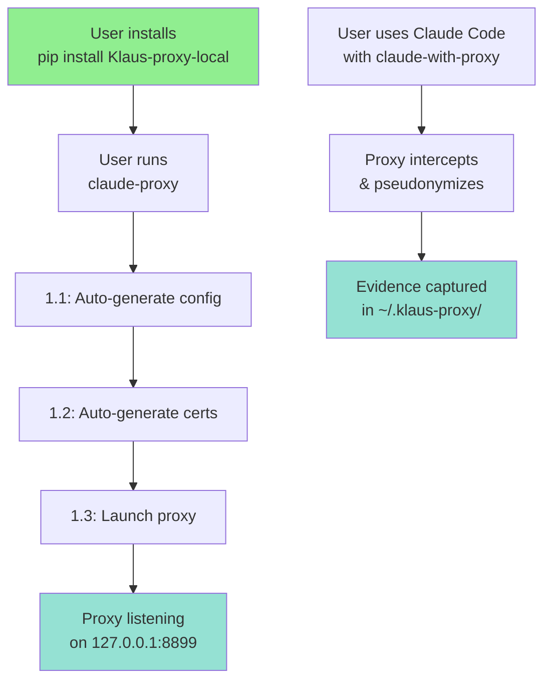

# ⚙️ FASE 1: Zero-Config Setup

> **Auto-generate config + certs on first run. No manual configuration needed.**

**Status:** 🟢 100% Complete (1.1 ✅ + 1.2 ✅ + 1.3 ✅ + 1.4 ✅ + 1.5 ✅)  
**Target:** v0.1.0  
**Related:** [INDEX.md](./INDEX.md) | [QUICK_START.md](./QUICK_START.md)

---

## 📋 Overview



---

## 🎯 5 Subtasks

### 1.1 | Auto-generate config on first run ✅
**File**: `src/Klaus_proxy_local/setup.py` (DONE)

**What**: Create `~/.klaus-proxy/config.json` on first run with:
- Auto-generated salt (via `secrets.token_hex(16)`)
- Capture directory paths
- Vault path
- Log level

**Tests**: `tests/test_fase1_setup.py::test_config_auto_generates` ✅ (18 test methods)

---

### 1.2 | Auto-generate mitmproxy certs ✅
**File**: `src/Klaus_proxy_local/certs.py` (DONE)

**What**: Generate `~/.mitmproxy/mitmproxy-ca-cert.pem` if missing

**Tests**: `tests/test_fase1_certs.py::test_certs_auto_generate` ✅ (49 test methods)

---

### 1.3 | Smart proxy launcher ✅
**File**: `src/Klaus_proxy_local/launcher.py` (DONE)

**What**: `claude-proxy` command that:
- Calls 1.1 (auto-config)
- Calls 1.2 (auto-certs)
- Launches mitmdump with addons
- Shows status dashboard

**Entry point**: `pyproject.toml` → `claude-proxy` ✅

**Tests**: `tests/test_fase1_launcher.py::test_launcher_*` ✅ (30+ test methods)

---

### 1.4 | Wrapper scripts ✅
**Files**: `scripts/claude-with-proxy.*` (DONE)

**What**: Shell wrappers for all platforms:
- `scripts/claude-with-proxy.sh` (bash/zsh)
- `scripts/claude-with-proxy.fish` (fish)
- `scripts/claude-with-proxy.ps1` (PowerShell)
- `scripts/claude-with-proxy.bat` (CMD)

Each sets env vars + executes `claude`

**Installation**: `src/Klaus_proxy_local/install_wrappers.py`
- Entry point: `klaus-install-wrappers` (added to pyproject.toml)
- Copies wrappers to ~/.local/bin/ or %APPDATA%\Scripts

**Tests**: `tests/test_fase1_wrappers.py` (25+ tests) ✅ and `tests/test_fase1_wrappers_install.py` (15+ tests) ✅

---

### 1.5 | Shell detection + auto-install ✅
**File**: `src/Klaus_proxy_local/setup_shell.py` (DONE)

**What**: `klaus-setup` command that:
- Detects shell (bash/zsh/fish/powershell)
- Asks user if they want auto-enable
- Adds hook to shell config
- Installs wrapper scripts

**Tests**: `tests/test_fase1_shell.py::test_detect_shell_*` ✅ (30+ test methods)

**Entry point**: `pyproject.toml` → `klaus-setup` ✅

---

## 🏗️ Architecture

```
Installation:
  pip install Klaus-proxy-local
    ↓
    ├─ Installs src/ + scripts/
    └─ Entry points in pyproject.toml:
       ├─ claude-proxy → launcher.py:main()
       ├─ claude-with-proxy → scripts/claude-with-proxy.sh
       └─ klaus-setup → setup_shell.py:interactive_setup_shell()

First Run (claude-proxy):
  1. setup.py:init_config_if_missing() → ~/.klaus-proxy/config.json
  2. certs.py:ensure_mitmproxy_certs() → ~/.mitmproxy/cert.pem
  3. launcher.py:main() → mitmdump -p 8899 + status dashboard

User Flow:
  Terminal 1: claude-proxy (stays running)
  Terminal 2: claude-with-proxy "question" (or) claude if klaus-setup was run
```

---

## 📁 Files to Create/Modify

```
src/Klaus_proxy_local/
├── __init__.py           (update version to 0.1.0rc1)
├── main.py               (update)
├── setup.py              ✨ NEW - Auto-config generation
├── certs.py              ✨ NEW - Auto-cert generation
├── launcher.py           ✨ NEW - Smart proxy launcher
└── setup_shell.py        ✨ NEW - Shell detection + auto-enable

scripts/
├── claude-with-proxy.sh  ✨ NEW - Bash/zsh wrapper
├── claude-with-proxy.fish ✨ NEW - Fish wrapper
├── claude-with-proxy.ps1 ✨ NEW - PowerShell wrapper
└── claude-with-proxy.bat ✨ NEW - CMD wrapper

tests/
├── test_fase1_setup.py   ✨ NEW
├── test_fase1_certs.py   ✨ NEW
├── test_fase1_launcher.py ✨ NEW
├── test_fase1_shell.py   ✨ NEW
└── test_fase1_wrappers.py ✨ NEW

pyproject.toml           (update entry points)
```

---

## ✅ Implementation Checklist

### 1.1: Auto-generate config
- [ ] Create `src/Klaus_proxy_local/setup.py`
  - [ ] `init_config_if_missing()` function
  - [ ] Generate salt with `secrets.token_hex(16)`
  - [ ] Create `~/.klaus-proxy/` directory (0o700)
  - [ ] Write `config.json` with chmod 0o600
- [ ] Write tests
- [ ] Manual verification

### 1.2: Auto-generate certs
- [ ] Create `src/Klaus_proxy_local/certs.py`
  - [ ] `ensure_mitmproxy_certs()` function
  - [ ] Detect if mitmproxy installed
  - [ ] Run mitmproxy to generate certs
  - [ ] Verify cert file exists
- [ ] Write tests
- [ ] Manual verification

### 1.3: Smart proxy launcher
- [ ] Create `src/Klaus_proxy_local/launcher.py`
  - [ ] `main()` function
  - [ ] Orchestrate 1.1 + 1.2
  - [ ] Launch mitmdump with addons
  - [ ] Show status dashboard
- [ ] Update `pyproject.toml` entry point
- [ ] Write tests
- [ ] Manual verification

### 1.4: Wrapper scripts
- [ ] Create `scripts/claude-with-proxy.sh`
- [ ] Create `scripts/claude-with-proxy.fish`
- [ ] Create `scripts/claude-with-proxy.ps1`
- [ ] Create `scripts/claude-with-proxy.bat`
- [ ] Install logic in setup (or pip install hook)
- [ ] Write tests

### 1.5: Shell detection + auto-install
- [ ] Create `src/Klaus_proxy_local/setup_shell.py`
  - [ ] `detect_shell()` function
  - [ ] `get_config_file(shell)` function
  - [ ] `add_hook(shell, config)` function
  - [ ] `interactive_setup_shell()` main function
- [ ] Update `pyproject.toml` entry point
- [ ] Write tests
- [ ] Manual verification

---

## 🎯 Key Design Decisions

### 1. Config Location
```
~/.klaus-proxy/
├── config.json          # User config (auto-generated)
├── captures/
│   ├── original/        # Real data (secrets redacted)
│   ├── sent/            # Pseudonymized data
│   └── .vault.json      # Mapping (real ↔ pseudo)
└── .mitmproxy-ca-cert.pem  # Proxy cert
```

**Why**: 
- `~/.local/share/` is XDG-compliant but `.klaus-proxy` is simpler
- Per-user, not per-project
- Isolated from project code

### 2. Wrapper Scripts (primary method)
```bash
claude-with-proxy "question"
```

**Why**:
- Works on all platforms (bash, zsh, fish, PowerShell, CMD, Windows)
- No shell config modification needed
- Explicit opt-in

### 3. Shell Auto-enable (optional)
```bash
klaus-setup  # One-time setup
claude "question"  # Auto-proxies if proxy running
```

**Why**:
- For users who want transparency
- Still manual (user has to run `klaus-setup`)
- Respects shell config

### 4. Fail-closed design preserved
If proxy crashes:
- Wrapper detects proxy not running → error message
- Environment variables set but proxy down → Claude Code hangs (intentional)

---

## 🧪 Test Strategy

### Unit Tests (fast, no disk/network)
```python
# test_fase1_setup.py
def test_config_auto_generates():
    # Verify config.json created with correct structure
    pass

def test_salt_is_random():
    # Verify salt is not default, is random
    pass

def test_config_permissions_secure():
    # Verify chmod 0o600
    pass

# test_fase1_shell.py
def test_detect_shell_zsh():
    # SHELL=/bin/zsh → "zsh"
    pass

def test_detect_shell_bash():
    # SHELL=/bin/bash → "bash"
    pass

def test_add_hook_zsh():
    # Verify hook added to ~/.zshrc correctly
    pass
```

### Integration Tests (with real filesystem)
```python
def test_full_setup_flow():
    # 1. init_config_if_missing()
    # 2. ensure_mitmproxy_certs()
    # 3. launcher.main() (don't actually launch, just verify structure)
    pass

def test_wrapper_script_exists():
    # Verify scripts/ files created and executable
    pass
```

### Manual Verification
```bash
# Terminal 1
claude-proxy

# Terminal 2
claude-with-proxy "hola"  # Should work

# Verify artifacts
ls ~/.klaus-proxy/
cat ~/.klaus-proxy/config.json
```

---

## 🚀 Milestones

| Task | Est. Time | Blocker For |
|------|-----------|------------|
| 1.1 (Auto-config) | 2-3h | 1.2, 1.3 |
| 1.2 (Auto-certs) | 1-2h | 1.3 |
| 1.3 (Launcher) | 2-3h | 1.4, 1.5 |
| 1.4 (Wrappers) | 1-2h | Testing |
| 1.5 (Shell detection) | 2-3h | Final testing |
| **TOTAL** | **8-13 hours** | v0.1.0 |

---

## 📊 Changes Summary (Projected)

```
New files:
  src/Klaus_proxy_local/setup.py         ~150 lines
  src/Klaus_proxy_local/certs.py         ~100 lines
  src/Klaus_proxy_local/launcher.py      ~200 lines
  src/Klaus_proxy_local/setup_shell.py   ~250 lines
  scripts/claude-with-proxy.sh           ~20 lines
  scripts/claude-with-proxy.fish         ~15 lines
  scripts/claude-with-proxy.ps1          ~20 lines
  scripts/claude-with-proxy.bat          ~15 lines
  tests/test_fase1_*.py                  ~500 lines
  docs/FASE1_ZERO_CONFIG.md              This file

Modified files:
  pyproject.toml                         +3 entry points
  src/Klaus_proxy_local/__init__.py      version → 0.1.0rc1
  src/Klaus_proxy_local/main.py          Update if needed
  README.md                              Update setup section

Total: ~1200 lines of new code + tests
```

---

## 🔗 See Also

- [INDEX.md](./INDEX.md) — Documentation map
- [QUICK_START.md](./QUICK_START.md) — User guide (will reference FASE 1)
- [SECURITY_HARDENING.md](./SECURITY_HARDENING.md) — FASE 0 fixes
- [THREAT_MODEL.md](./THREAT_MODEL.md) — Threat analysis

---

**Status**: 🔴 Not started  
**Next**: Start with 1.1 (Auto-config generation)  
**Branch**: `feat/fase1-zero-config`
