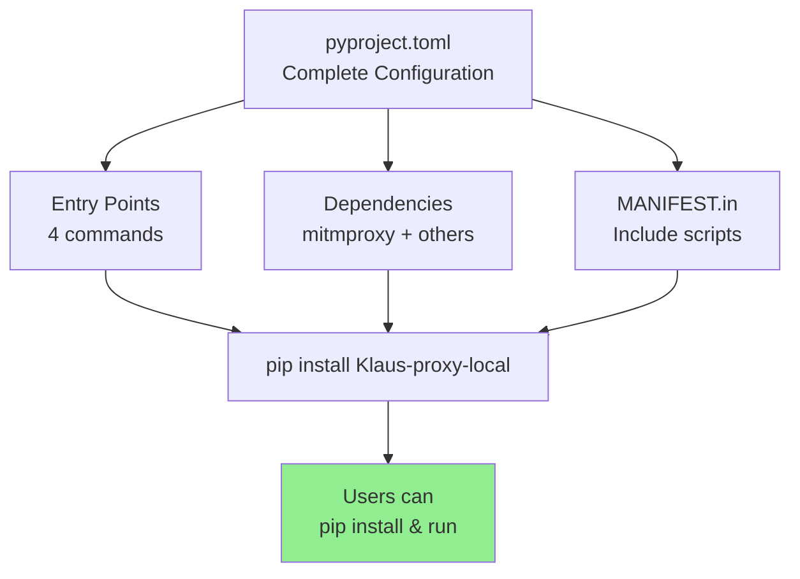

# 📦 FASE 3: Update pyproject.toml + Packaging

> **Prepare Klaus Proxy Local for distribution on PyPI.**

**Status:** ✅ Complete  
**Target:** v0.1.0  
**Related:** [FASE1_ZERO_CONFIG.md](./FASE1_ZERO_CONFIG.md) | [INDEX.md](./INDEX.md)

---

## 🎯 Overview

Package configuration for PyPI distribution and pip installation.



---

## 📋 Changes Made

### pyproject.toml Updates

**1. Added mitmproxy dependency** (line 26)
```toml
dependencies = [
    "httpx>=0.27",
    "fastapi>=0.111",
    "uvicorn[standard]>=0.30",
    "anthropic>=0.30",
    "mitmproxy>=10.0",  # ← Added for proxy functionality
]
```

**2. Configured setuptools** (lines 46-55)
```toml
[tool.setuptools]
package-dir = { "" = "src" }
packages = ["Klaus_proxy_local"]
include-package-data = true

[tool.setuptools.packages.find]
where = ["src"]

[tool.setuptools.package-data]
Klaus_proxy_local = []
```

**3. Verified entry points** (lines 40-44)
```toml
[project.scripts]
Klaus-proxy = "Klaus_proxy_local.main:main"
claude-proxy = "Klaus_proxy_local.launcher:main"
klaus-install-wrappers = "Klaus_proxy_local.install_wrappers:main"
klaus-setup = "Klaus_proxy_local.setup_shell:main"
```

### MANIFEST.in (New File)

Ensures distribution includes:
- All documentation (docs/*.md)
- All wrapper scripts (scripts/claude-with-proxy.*)
- All tests (tests/*.py)
- All source code (src/**/*.py)

```
include README.md
include LICENSE
recursive-include docs *.md
include scripts/claude-with-proxy.*
recursive-include tests *.py
recursive-include src *.py
```

---

## 🔍 Verification

### Entry Points

| Command | Module | Function | Purpose |
|---------|--------|----------|---------|
| `Klaus-proxy` | main.py | main() | Legacy entry point |
| `claude-proxy` | launcher.py | main() | Start proxy |
| `klaus-setup` | setup_shell.py | main() | Interactive setup |
| `klaus-install-wrappers` | install_wrappers.py | main() | Install scripts |

### Dependencies

**Core** (required):
- httpx >= 0.27 (HTTP client)
- fastapi >= 0.111 (Web framework)
- uvicorn[standard] >= 0.30 (ASGI server)
- anthropic >= 0.30 (Anthropic API)
- mitmproxy >= 10.0 (Proxy framework)

**Development** (optional):
- pytest >= 8.0 (Testing)
- pytest-cov >= 5.0 (Coverage)
- ruff == 0.16.0 (Linter, pinned for reproducibility)
- black == 25.11.0 (Formatter, pinned for reproducibility)

### Package Structure

```
Klaus-proxy-local/
├── pyproject.toml           ← PEP 517/518 build config
├── MANIFEST.in              ← Include patterns
├── README.md                ← Package description
├── LICENSE                  ← MIT license
│
├── src/Klaus_proxy_local/   ← Source code package
│   ├── __init__.py
│   ├── main.py              ← Legacy main (Klaus-proxy)
│   ├── setup.py             ← Auto-config (FASE 1.1)
│   ├── certs.py             ← Auto-certs (FASE 1.2)
│   ├── launcher.py          ← Proxy launcher (FASE 1.3)
│   ├── install_wrappers.py  ← Wrapper installer (FASE 1.4)
│   └── setup_shell.py       ← Shell auto-enable (FASE 1.5)
│
├── scripts/                 ← Wrapper scripts (included in distribution)
│   ├── claude-with-proxy.sh
│   ├── claude-with-proxy.fish
│   ├── claude-with-proxy.ps1
│   └── claude-with-proxy.bat
│
├── docs/                    ← Documentation (included)
│   ├── INDEX.md
│   ├── QUICK_START.md
│   ├── SECURITY_HARDENING.md
│   ├── THREAT_MODEL.md
│   └── ...
│
├── tests/                   ← Test suites (included)
│   ├── test_fase0_*.py
│   ├── test_fase1_*.py
│   └── ...
```

---

## 🏗️ Build Instructions

### Local Development Install

```bash
# Install in editable mode with dev dependencies
pip install -e ".[dev]"

# Verify entry points work
klaus-setup --help
claude-proxy --help
```

### Build Distribution

```bash
# Install build tools
pip install build

# Build wheel and source distribution
python -m build

# Output:
# dist/Klaus-proxy-local-0.1.0-py3-none-any.whl
# dist/Klaus-proxy-local-0.1.0.tar.gz
```

### Install from Distribution

```bash
# From wheel
pip install dist/Klaus-proxy-local-0.1.0-py3-none-any.whl

# From source distribution (slower)
pip install dist/Klaus-proxy-local-0.1.0.tar.gz
```

### Upload to PyPI

```bash
# Install twine
pip install twine

# Upload to test PyPI first
twine upload --repository testpypi dist/*

# Then to production PyPI
twine upload dist/*
```

---

## ✅ Checklist

- [x] mitmproxy added to dependencies
- [x] All entry points verified in pyproject.toml
- [x] setuptools configuration complete
- [x] MANIFEST.in includes all files
- [x] Package structure correct (src/ layout)
- [x] Include-package-data enabled
- [x] Python version specified (>=3.10)
- [x] License included (MIT)
- [x] README linked
- [x] All tests included
- [x] All documentation included

---

## 📦 Installation for End Users

After release on PyPI:

```bash
# Install Klaus Proxy Local
pip install Klaus-proxy-local

# Interactive setup (detects shell, adds hook)
klaus-setup

# Reload shell
exec $SHELL

# Start using Klaus Proxy
claude "your question"   # Automatically through proxy
```

---

## 🔗 Related

- [FASE 1.0: Zero-Config Setup](./FASE1_ZERO_CONFIG.md)
- [QUICK_START.md](./QUICK_START.md)
- [SECURITY_HARDENING.md](./SECURITY_HARDENING.md)
- [INDEX.md](./INDEX.md)
