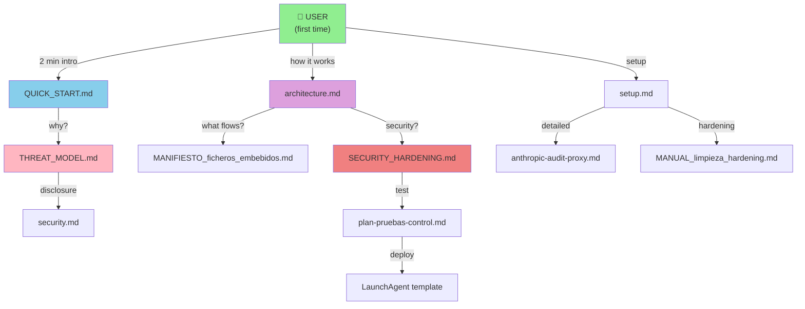

# 📚 Klaus Proxy Local — Documentation Index

> **Complete documentation map** for Klaus Proxy Local v0.1.0

---

## 🚀 **Start Here**

| For | Read | Time |
|-----|------|------|
| **First time?** | [QUICK_START.md](./QUICK_START.md) | 2 min |
| **How does it work?** | [ARCHITECTURE.md](./architecture.md) | 5 min |
| **Technical setup?** | [SETUP.md](./setup.md) | 10 min |
| **What's the catch?** | [THREAT_MODEL.md](./THREAT_MODEL.md) | 5 min |

---

## 📖 **Complete Structure**

```
docs/
├── INDEX.md (you are here)
│
├─ 🟢 USER GUIDES
│  ├── QUICK_START.md          — Install & use in 2 minutes
│  ├── THREAT_MODEL.md         — What we protect, what we don't
│  ├── FAQ.md                  — Common questions [TBD]
│  └── TROUBLESHOOTING.md      — Common issues [TBD]
│
├─ 🔵 ARCHITECTURE & DESIGN
│  ├── architecture.md         — How Klaus Proxy works
│  ├── MANIFIESTO_ficheros_embebidos.md — What data flows
│  ├── SECURITY_HARDENING.md   — v0.1.0 security fixes (FASE 0) ✅
│  └── FASE1_ZERO_CONFIG.md    — Auto-config + certs (FASE 1) 🔴
│
├─ 🛠️  TECHNICAL DOCS
│  ├── setup.md                — Complete setup guide
│  ├── anthropic-audit-proxy.md — Full runbook (legacy, see setup.md)
│  ├── MANUAL_limpieza_hardening.md — Data-at-rest mitigation
│  ├── ci-cd.md                — CI/CD pipeline
│  └── security.md             — Security policy & disclosure
│
├─ 📋 TESTING & VALIDATION
│  ├── plan-pruebas-control.md — Test plan & acceptance criteria
│  └── telemetria-anthropic-event-logging.md — Event logging
│
└─ 📝 DEPLOYMENT
   └── com.customer1.anthropic-audit-proxy.plist.template — macOS LaunchAgent
```

---

## 🔗 **Document Dependencies**



---

## 📌 **Key Documents by Purpose**

### **For Privacy-Conscious Developers**
→ [QUICK_START.md](./QUICK_START.md) → [THREAT_MODEL.md](./THREAT_MODEL.md) → [architecture.md](./architecture.md)

### **For DevOps / Deployment**
→ [setup.md](./setup.md) → [MANUAL_limpieza_hardening.md](./MANUAL_limpieza_hardening.md) → [ci-cd.md](./ci-cd.md)

### **For Security Auditors**
→ [THREAT_MODEL.md](./THREAT_MODEL.md) → [SECURITY_HARDENING.md](./SECURITY_HARDENING.md) → [security.md](./security.md) → [plan-pruebas-control.md](./plan-pruebas-control.md)

### **For Contributors**
→ [architecture.md](./architecture.md) → [SECURITY_HARDENING.md](./SECURITY_HARDENING.md) → [ci-cd.md](./ci-cd.md)

---

## 🔄 **Document Update Policy**

| Document | Updated | Sync with |
|----------|---------|-----------|
| QUICK_START.md | Per release | README.md |
| THREAT_MODEL.md | Per major feature | security.md |
| SECURITY_HARDENING.md | Per security fix | CHANGELOG.md |
| architecture.md | Per architectural change | — |
| setup.md | Per setup change | anthropic-audit-proxy.md |

---

## 📝 **Versions**

- **v0.1.0** (in progress): Privacy tool for individual developers
  - [QUICK_START.md](./QUICK_START.md)
  - [THREAT_MODEL.md](./THREAT_MODEL.md)
  - [SECURITY_HARDENING.md](./SECURITY_HARDENING.md)

- **v0.2.0** (roadmap): Streaming, rate limiting
- **v1.0.0** (roadmap): Production-ready

---

## ✅ **Checklist: Docs are Complete**

- [ ] QUICK_START.md — Clear for non-technical users
- [ ] THREAT_MODEL.md — Explains what's protected & what's not
- [ ] SECURITY_HARDENING.md — Documents v0.1.0 security fixes
- [ ] architecture.md — Updated for v0.1.0
- [ ] setup.md — Covers all installation methods
- [ ] README.md — Links to QUICK_START
- [ ] All cross-references valid (no broken links)
- [ ] Flowcharts render correctly

---

## 🔗 **See Also**

- [README.md](../README.md) — Project overview
- [CHANGELOG.md](../CHANGELOG.md) — Version history
- [CONTRIBUTING.md](../CONTRIBUTING.md) — How to contribute
- [SECURITY.md](./security.md) — Security policy
