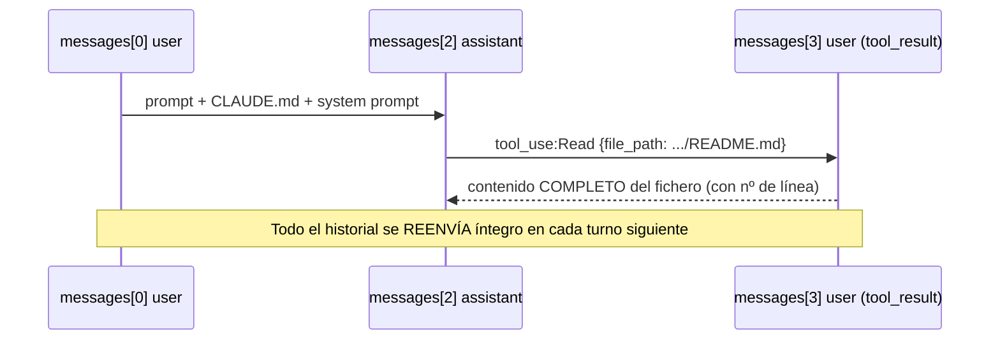
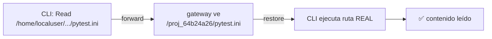

# 📁 Manifiesto — información enviada en `/v1/messages`

## 🤔 ¿Qué hago? ¿Cómo lo hago? ¿Y para qué lo hago?

- **¿Qué hago?** Documento, de forma exhaustiva y con evidencia, **toda** la información que sale del equipo en cada petición de inferencia `/v1/messages`.
- **¿Cómo lo hago?** A partir de las capturas TLS reales (`captures/*.json`) obtenidas con el proxy `mitmproxy` + addon ([`anthropic_payload_capture.py`](../src/anthropic_payload_capture.py)) y su análisis ([`anthropic_payload_analyze.py`](../src/anthropic_payload_analyze.py)).
- **¿Para qué lo hago?** Para cerrar la evidencia de privacidad/compliance: qué datos, de qué tipo, y hacia qué destino.

> **Destino real de la inferencia:** **`llm.tools.cloud.customer1.es`** (gateway corporativo customer 1, GCP `203.0.113.10`), no `api.anthropic.com`. Modelo `claude-opus-4-8`, `max_tokens=64000`, `anthropic-version: 2023-06-01`. Ver frontera de datos completa en [`anthropic-audit-proxy.md`](./anthropic-audit-proxy.md).

---

## 📦 Categorías de información que SIEMPRE se envían

Todo esto viaja al gateway en **cada** petición de inferencia:

| # | Categoría | Dónde en el payload | Detalle |
| --- | --- | --- | --- |
| 1 | **System prompt** | `system[0..2]` (~6,9 KB) | Cabecera de billing, identidad del asistente, `# Harness`, `# Memory`, `# Environment`, `# Context management`, listado de las 25 tools |
| 2 | **Instrucciones de proyecto** | `messages[0]` · bloque `text` (system-reminder `# claudeMd`) | **`CLAUDE.md` ÍNTEGRO** (~200 líneas) |
| 3 | **Prompt del usuario** | `messages[0]` · bloque `text` | El texto literal que escribe el usuario |
| 4 | **Catálogo de agentes y skills** | `messages[1]` (role=system) | Tipos de agente + 13 skills con descripción |
| 5 | **Definición de herramientas** | `tools[]` | 25 tools con descripción y JSON Schema completo |
| 6 | **Contenido de ficheros** | `tool_use` (ruta) + `tool_result` (contenido) | Todo fichero leído (Read) o escrito (Edit/Write), **con números de línea**, acumulado en el historial |

---

## 🔴 Datos sensibles / metadata expuesta

### En el system prompt (`system[2]`)

| Dato | Ejemplo capturado |
| --- | --- |
| Ruta home absoluta | `/home/localuser/...` |
| Usuario del SO | `localuser` |
| Identidad git | `gituser` |
| Rama, estado y últimos 5 commits | `main`, `M .gitignore`, hashes + mensajes |
| Versión de OS, plataforma, shell | `Darwin 25.5.0`, `darwin`, `zsh` |

> El `gitStatus` del system prompt es un **snapshot del arranque de la sesión**, no el estado en vivo.

### En `messages[0]` — el `CLAUDE.md` completo

El `CLAUDE.md` **no viaja en el system prompt**, sino como **primer bloque `text` del primer mensaje de usuario**, envuelto en `<system-reminder># claudeMd …</system-reminder>`. Se envía **íntegro y en cada turno**. Contiene:

- Repositorio y organización (`example-org/customer1-ecosistema1`)
- Identidad de negocio: los dos clientes **orgcode1** y **orgcode2**, Kanban #765
- Usuario de asignación (`gituser`)
- Estructura operativa interna completa (compliance, runbooks, roles K*)

> ⚠️ **Contradicción de gobierno:** el propio `CLAUDE.md` se declara *"nunca en git"*, pero se transmite completo al gateway externo en cada petición.

---

## 🔁 Mecanismo de embebido de ficheros (patrón `Read`)



**Consecuencia:** en una sesión larga, cada fichero leído/editado se acumula en el historial y **se reenvía repetidamente** al gateway en todas las peticiones posteriores.

---

## 📁 Ficheros del repo detectados como embebidos (esta auditoría)

| Fichero | Vía de embebido | Contenido |
| --- | --- | --- |
| `CLAUDE.md` | `messages[0]` (system-reminder) | íntegro |
| `README.md` | `tool_use:Read` → `tool_result` | íntegro (~13,6 KB) |
| `pytest.ini` | `tool_use:Read` → `tool_result` | íntegro |

---

## 🧾 Capturas analizadas

| Fichero | host | endpoint | messages | tools | system chars |
| --- | --- | --- | --- | --- | --- |
| `20260721_104122_anthropic_payload.json` | `llm.tools.cloud.customer1.es` | `POST /v1/messages?beta=true` | 4 | 25 | 6922 |
| `20260721_104126_anthropic_payload.json` | `api.anthropic.com` | `POST /api/event_logging/v2/batch` | — | — | — (102 eventos telemetría) |

> ⚠️ Volcado íntegro y legible de cada payload de inferencia en los ficheros `*.decoded.md` de este directorio. El `tool_result` del `.decoded.md` se trunca a 5.000 chars **solo en el render**; el `.json` crudo conserva el contenido completo.

## 🛡️ Registro de control — datos BLOQUEADOS (no salieron al gateway)

> **Validación end-to-end:** `2026-07-21` · proxy dual `pseudonymize + capture` en `:8890` · prompt de prueba que fuerza un `Read`. La evidencia fue una corrida manual única (directorio `validation/` ya retirado — no había proceso que lo alimentara); la verificación viva se hace hoy sobre `sent/` con `anthropic_capture_verify.py`. Addon: [`anthropic_payload_pseudonymize.py`](../src/anthropic_payload_pseudonymize.py).

Cada dato sensible se sustituyó por un seudónimo estable **antes** de salir al gateway y se revirtió en la respuesta. Verificado por grep sobre las capturas (lo que realmente salió por el cable):

| Dato real (categoría) | Seudónimo emitido | Apariciones en claro en las capturas | Estado |
| --- | --- | --- | --- |
| `/home/localuser/proyectos/customer1-ecosistema1` (raíz repo) | `/proj_64b24a26` | **0** | 🟢 Bloqueado |
| `/home/localuser` (home) | `/home_c8104cb8` | **0** | 🟢 Bloqueado |
| `gituser` (identidad git) | `id_e1f4d262` | **0** | 🟢 Bloqueado |
| `localuser` (usuario SO) | `id_05c5af95` | **0** | 🟢 Bloqueado |
| `noreply@example.com` (email git) | `email_08c287cc` | **0** | 🟢 Bloqueado |

**Prueba tangible de la palanca de rutas** — el `tool_use:Read` que viajó al gateway (`20260721_123926_anthropic_payload.json`, `messages[2]`):

```
file_path: /proj_64b24a26/pytest.ini      ← el nombre real NUNCA salió
```

**Prueba de la reversión (restore):** el proceso `claude` respondió correctamente qué configura `pytest.ini`. Solo es posible si el proxy revirtió `/proj_64b24a26` → ruta real **antes** de que el CLI ejecutara el `Read`. Ida y vuelta confirmadas.



### Ampliación de cobertura (2026-07-21) — Tier 1 secretos + Tier 2 word-literals

Se amplía lo que **no sale al gateway** con dos familias nuevas:

| Familia | Qué bloquea | Tratamiento | Reversible |
| --- | --- | --- | --- |
| **Tier 1 — secretos** | clave privada PEM, AWS `AKIA…`, tokens GitHub `gh?_…`, Google `AIza…`, Slack `xox?-…`, JWT `eyJ….….…`, y `secret/token/password/api_key = valor` | Redacción a `«REDACTED:label»` | ❌ No (no entra al vault — no reaparece) |
| **Tier 2 — word-literals** | org/repo del remote (autodetectados), y por env códigos de cliente `orgcode1`/`orgcode2`, IDs cloud (`orgcode3`), dominios corporativos | Seudónimo con frontera de palabra | ✅ Sí |

Comprobación en máquina real (`build_rules` sobre este repo):

- `word_literals` autodetectados: `example-org`, `customer1-ecosistema1`.
- Forward de muestra → `aws AKIA… → «REDACTED:aws-access-key»`, `password="…" → password="«REDACTED:secret-kv»"`, `example-org → org_ac65636e`. `grep` del secreto en la salida: **0 apariciones**.
- Los secretos **no** están en el vault → `restore` no los reconstruye (irreversibilidad verificada por test).

> **Frontera de palabra:** `orgcode2` **no** corrompe `HTTPS` ni `orgcode1` a `COMMIT` — los códigos de cliente son opt-in vía `ANTHROPIC_PSEUDO_WORD_LITERALS` por su ambigüedad de 2 letras. Verificado en tests.

> ⚠️ **Ámbito del bloqueo:** se bloquea lo que el vault conoce (rutas raíz, usuario, identidad git, org/repo, word-literals), lo que casa por regex (email/IPv4) y los secretos (redacción irreversible). **NO** se bloquea el contenido del código ni el texto del prompt/`CLAUDE.md` que el modelo necesita entender: para eso la palanca es *no enviarlo*, no *sustituirlo*.

### Validación de la ampliación — prueba de carga real (2026-07-21)

Prompt: *"Lee todos los ficheros de mi proyecto y dame un resumen completo de su funcionalidad"* (fuerza decenas de `Read`), enrutado por el proxy dual en `:8899`.

| Comprobación | Resultado |
| --- | --- |
| Capturas de inferencia al gateway | 8 analizadas |
| JSON válido en el egress | **8/8** ✅ |
| Fugas en claro de raíz repo / home / usuario / identidad git / org / repo | **0 / 0 / 0 / 0 / 0 / 0** 🟢 |
| Seudónimos `/proj_…` presentes | 8/8 |
| Ejecución del CLI | ✅ resumen completo (reversión de rutas correcta) |

**Palanca compuesta verificada** — una ruta de `tool_use:Read` tal como salió al gateway:

```
/home_c8104cb8/.claude/projects/-Users-id_05c5af95-proyectos-org_6313b955/.../bltxa8wi1.txt
```

Incluso dentro del segmento con guiones (`-Users-localuser-proyectos-customer1-ecosistema1`) se seudonimizan por separado el **usuario** (`id_05c5af95`) y el **nombre de repo** (`org_6313b955`). El modelo confirmó en su respuesta que veía identificadores seudonimizados (`ip_…`, `org_…`, `email_…`).

> 🐛 **Bug encontrado y corregido durante la validación:** la primera pasada devolvió `400 Invalid JSON`. Causa: la regla `secret-kv` operaba sobre el **JSON ya serializado** y se comió el `\` de un `\"` en código (`password = os.getenv("…")`), dejando una comilla suelta. Arreglo: (1) **transformación estructural** — se parsea el JSON y se seudonimizan solo los *valores string*, re-serializando (el encoder re-escapa, imposible romper el JSON); (2) `secret-kv` pasa a **opt-in** (`ANTHROPIC_PSEUDO_SECRET_KV=1`) por ser ruidoso sobre código; los detectores precisos (PEM/AWS/GitHub/Google/Slack/JWT) siguen activos por defecto. Cubierto por el test `test_json_body_with_code_stays_valid`.

---

## 📤 Ficheros externalizados / `<persisted-output>` — auditoría (2026-07-21)

Cuando un `tool_result` es grande (aquí un `find`/`ls -R` del repo, ~96 KB, 1512 líneas), Claude Code **no** lo mete inline sin más: lo **persiste en disco** y en el payload inserta un envoltorio `<persisted-output>`.

### Mecanismo real (verificado sobre capturas)

- El contenido completo se guarda en **dos rutas hardlinkeadas al mismo inodo** (mismo fichero, dos nombres):
  - `~/.claude/projects/<proj>/<session>/tool-results/<id>.txt`
  - `/private/tmp/claude-501/<proj>/<session>/tasks/<id>.output`
- En el payload de inferencia, el `tool_result` (`messages[3]` en la captura) contiene:

  ```
  <persisted-output>
  Output too large (95.8KB). Full output saved to: /home_c8104cb8/.../tool-results/bltxa8wi1.txt
  Preview (first 2KB):
  === TOP LEVEL ===
  ...
  </persisted-output>
  ```

### Lo que SÍ sale al gateway (y su tratamiento)

| Vía | Qué viaja | ¿Seudonimizado? |
| --- | --- | --- |
| **Inmediata** | Aviso `Output too large` + **preview de los primeros 2 KB** (41 líneas) + ruta local del `.txt` | ✅ Sí — `localuser`→`id_05c5af95`, ruta→`/home_…/…/org_…`; **0 fugas reales** |
| **Al leer** (`canReadOutputFile: true`) | Si el modelo hace `Read` del `.txt` persistido, el **contenido completo** se embebe y **se acumula** en el historial de turnos siguientes | ✅ Sí — captura con 317 líneas embebidas: `id_`×124, `org_`×30, `proj_`×57 y **0 fugas** de `/home/localuser`, `localuser`, `example-org`, `customer1-ecosistema1` |

> ✅ **Conclusión de red:** la externalización **no** es un canal de fuga hacia el gateway. Tanto el preview como el contenido completo (si se lee) atraviesan el proxy y se seudonimizan como cualquier `tool_result`. Verificado: firmas del listado presentes en ~29 capturas, **siempre en su forma seudonimizada**.

> 🔧 **Corrección de una observación previa:** en la primera validación (run de `pytest.ini`, 12:39) dije que "el contenido no aparecía inline". Era cierto **para aquel run** (no generó fichero grande), pero **no** es la regla general: en el run "lee todos los ficheros" (13:15) el contenido **sí** viajó —como preview y, tras el `Read`, completo—. Lo relevante es que en ambos casos salió seudonimizado.

### 🟠 Riesgo residual REAL: datos en reposo en disco local

Lo que la seudonimización **no** cubre (por diseño: el proxy solo ve la **red**, no el disco) es el propio fichero persistido:

| Propiedad | Valor observado |
| --- | --- |
| Contenido en disco | **En claro, sin seudonimizar** (`localuser` como owner aparece 27 veces en `bltxa8wi1.txt`) |
| Permisos | `-rw-r--r--` → **legible por cualquier usuario local** de la máquina |
| Ubicación `/private/tmp/...` | `tmp` — potencialmente purgable por el SO, pero persiste durante la sesión y después |
| Persistencia | **Sobrevive al cierre de la sesión** (ficheros de sesiones ya cerradas `86f0a7cc`, `6c6776dc` siguen presentes) |
| Versionado | Fuera del árbol del repo (`$HOME/.claude`, `/private/tmp`) → no acaba en git por ubicación |

> ⚠️ **Recomendación de compliance:** el vector de exposición de estos ficheros **no es Anthropic/gateway** (ahí van seudonimizados) sino **local data-at-rest**: contenido de repo en claro, world-readable, en `/private/tmp` y `~/.claude`. Mitigaciones: (1) `umask`/permisos más restrictivos en `~/.claude` y `claude-*` de `/tmp`; (2) limpieza periódica de `tool-results/` y `tasks/*.output` de sesiones cerradas; (3) cifrado de disco (FileVault) como control de fondo. No es tarea del seudonimizador de red.

---

## 🔒 Nota de secretos

Las cabeceras `Authorization` / `x-api-key` / `anthropic-organization-id` / `cookie` se **redactan** (`«REDACTED»`, `secrets_redacted: true`). El **cuerpo** del payload (prompts, CLAUDE.md, contenido de ficheros) **no** se redacta: es precisamente el objeto de esta auditoría.
