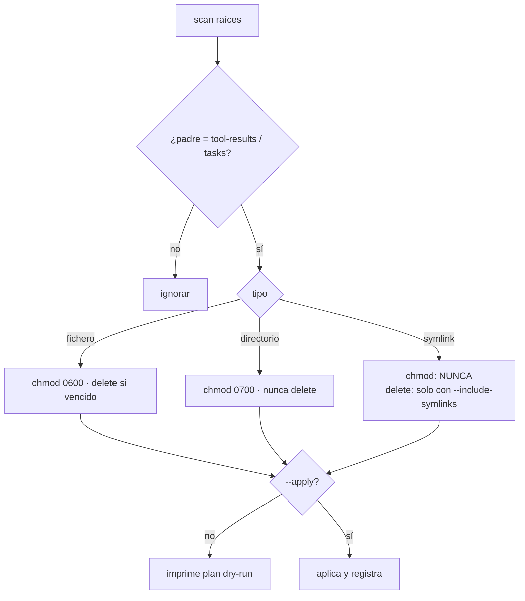

# 🧹 Manual de usuario — limpieza y hardening de artefactos en reposo

## 🤔 ¿Qué hago? ¿Cómo lo hago? ¿Y para qué lo hago?

- **¿Qué hago?** Documento cómo usar, ampliar y personalizar el script
  [`anthropic_artifacts_cleanup.py`](../src/anthropic_artifacts_cleanup.py),
  que mitiga el **único riesgo residual real** detectado en la auditoría de datos
  hacia Anthropic: los ficheros que Claude Code deja **en claro y world-readable**
  en el disco local.
- **¿Cómo lo hago?** El script restringe permisos (*hardening*) y borra artefactos
  vencidos (*limpieza*), siempre en **dry-run** salvo que se pida `--apply`.
- **¿Para qué lo hago?** Para cerrar el vector *data-at-rest*: la seudonimización de
  red **no** cubre el disco (el proxy solo ve la red). Ver el diagnóstico completo en
  [`MANIFIESTO_ficheros_embebidos.md`](./MANIFIESTO_ficheros_embebidos.md) §"Ficheros
  externalizados".

> 📍 Este documento vive en `docs/` y **se versiona** junto al resto de la
> documentación del proyecto. Lo que **no** se versiona son los **datos** de
> `captures/` (y el vault), gitignored por contener información sensible real.

---

## 🎯 Qué problema resuelve

Cuando un `tool_result` es grande, Claude Code vuelca su **contenido completo, en
claro**, a disco en dos ubicaciones hardlinkeadas al mismo inodo:

```text
~/.claude/projects/<proj>/<session>/tool-results/<id>.txt
/private/tmp/claude-<uid>/<proj>/<session>/tasks/<id>.output
```

Problemas observados en la máquina real:

| Propiedad | Estado por defecto | Riesgo |
| --- | --- | --- |
| Permisos | `-rw-r--r--` (0644) | Legible por **cualquier usuario** de la máquina |
| Contenido | Sin seudonimizar | Rutas, usuario, contenido de repo en claro |
| Persistencia | Sobrevive al cierre de sesión | Se acumula indefinidamente |
| Ubicación | Fuera del árbol git | No lo protege `.gitignore` |

El script deja los ficheros en **`0600`** (solo el owner) y los directorios en
**`0700`**, y opcionalmente borra los vencidos por antigüedad.

---

## 🚀 Uso rápido

```bash
# 1) Inventario — no toca nada, solo informa:
python3 src/anthropic_artifacts_cleanup.py

# 2) Ver qué haría (DRY-RUN): hardening + limpiar artefactos de >14 días
python3 src/anthropic_artifacts_cleanup.py --harden --clean --older-than-days 14

# 3) Ejecutar de verdad (requiere --apply):
python3 src/anthropic_artifacts_cleanup.py --harden --clean --apply
```

> ⚠️ **Seguridad por defecto:** sin `--apply` **nada** se modifica ni se borra. El
> borrado es difícilmente reversible, por eso el opt-in es explícito.

---

## 🎛️ Flags disponibles

| Flag | Efecto | Default |
| --- | --- | --- |
| *(ninguno)* | Solo inventario y resumen | — |
| `--harden` | Ficheros → `0600`, directorios de artefactos → `0700` | off |
| `--clean` | Borra artefactos regulares más antiguos que el umbral | off |
| `--older-than-days N` | Umbral de antigüedad (mtime) para `--clean` | `7` |
| `--include-symlinks` | Incluye symlinks en `--clean` (borra **solo el enlace**) | off |
| `--apply` | Ejecuta los cambios; sin él, todo es dry-run | off |
| `--home PATH` | Override de `$HOME` (pruebas) | `~` |
| `--tmp-base PATH` | Override de `/private/tmp/claude-<uid>` (pruebas) | auto |

---

## 🛡️ Garantías de seguridad del script

1. **Dry-run por defecto** — sin `--apply` solo imprime el plan.
2. **Contención de rutas** — solo actúa sobre entradas cuyo directorio padre sea
   `tool-results` o `tasks`. Cualquier acción fuera de ámbito se marca `SKIP`
   (verificado en `test_apply_skips_out_of_scope_paths`).
3. **Symlinks protegidos** — algunos `*.output` son enlaces a transcripts de
   subagentes (`subagents/agent-*.jsonl`). El script **nunca** hace `chmod` a través
   del enlace ni sigue el enlace para borrar su destino. En `--clean` los symlinks se
   ignoran salvo `--include-symlinks`, y aun así solo se borra el enlace.
4. **Idempotencia** — si los permisos ya son los objetivo, no se planifica nada.



---

## 🔧 Cómo ampliar o personalizar

Todo lo configurable vive en la cabecera de
[`anthropic_artifacts_cleanup.py`](../src/anthropic_artifacts_cleanup.py):

| Constante | Para qué | Ejemplo de cambio |
| --- | --- | --- |
| `ARTIFACT_DIRNAMES` | Nombres de directorio considerados "de artefactos" | Añadir `"shell-snapshots"` si Claude Code introduce otro tipo |
| `FILE_MODE` | Permisos objetivo de ficheros | `0o400` (solo lectura owner) para endurecer más |
| `DIR_MODE` | Permisos objetivo de directorios | — |
| `DEFAULT_OLDER_THAN_DAYS` | Umbral por defecto de `--clean` | `30` si prefieres retención larga |
| `default_tmp_base()` | Localización de la base temporal | Ajustar si el UID o la ruta `/private/tmp` cambian |

**Añadir una nueva raíz de descubrimiento:** edita `discover_artifact_dirs()` y añade
un `glob` a la nueva ubicación. El resto (clasificación, planificación, contención) lo
hereda automáticamente porque opera sobre el nombre del directorio padre.

**Cambiar la política de permisos** (p. ej. dejar ficheros en solo-lectura): modifica
`FILE_MODE = 0o400`. Los tests comprueban contra `ac.FILE_MODE`/`ac.DIR_MODE`, así que
siguen pasando sin tocarlos.

> 🧪 **Regla del repo:** todo cambio en el script debe mantener verdes sus tests
> ([`tests/test_anthropic_artifacts_cleanup.py`](../tests/test_anthropic_artifacts_cleanup.py), 22).
> Ejecuta: `pytest tests/test_anthropic_artifacts_cleanup.py`
> (la config de pytest y `pytest-cov` vienen de `pyproject.toml` + `pip install -e ".[dev]"`).

---

## ⏰ Automatización opcional (cron / launchd)

Para un hardening periódico y una limpieza de artefactos antiguos, por ejemplo cada día:

```bash
# crontab -e  — hardening diario + purga de >30 días, a las 08:07
7 8 * * *  cd ~/proyectos/customer1-ecosistema1 && \
  /usr/bin/python3 src/anthropic_artifacts_cleanup.py \
    --harden --clean --older-than-days 30 --apply >> ~/.claude/artifacts-cleanup.log 2>&1
```

> Prueba primero **sin** `--apply` para revisar el plan antes de automatizar el borrado.

---

## 🔗 Documentos relacionados

- [`MANIFIESTO_ficheros_embebidos.md`](./MANIFIESTO_ficheros_embebidos.md) — qué sale al
  gateway y el diagnóstico del riesgo *data-at-rest*.
- [`anthropic-audit-proxy.md`](./anthropic-audit-proxy.md) — frontera de datos completa y seudonimizador de red.

> 🔒 Recordatorio de control de fondo: el hardening a nivel de permisos **complementa**
> —no sustituye— el cifrado de disco (FileVault). Ambos operan en capas distintas.
