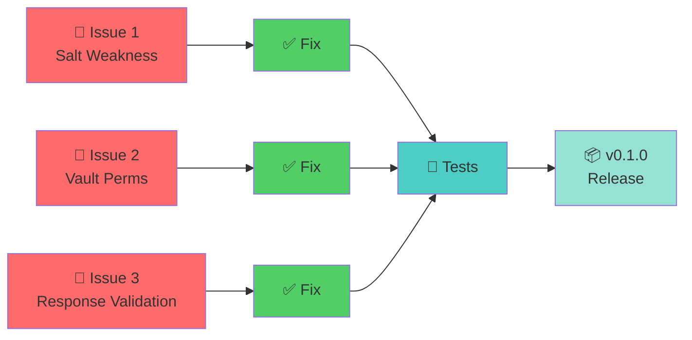

# 🔒 Security Hardening — v0.1.0

> **FASE 0: Three critical security fixes before production release**

**Status:** 🔴 In Progress  
**Target:** Before v0.1.0 release  
**Related:** [THREAT_MODEL.md](./THREAT_MODEL.md) | [security.md](./security.md) | [architecture.md](./architecture.md)

---

## 📋 Overview



---

## 🔴 Issue #1: Weak Salt by Default (CRITICAL)

### The Problem

**File:** `src/anthropic_payload_pseudonymize.py:206`

```python
def _salt() -> str:
    return os.environ.get("ANTHROPIC_PSEUDO_SALT", "mo-ecosistema1-audit")
```

**Why it's dangerous:**
- Salt is **hardcoded and public** (visible in repo)
- SHA1 is **fast** (~10M hashes/sec on modern CPU)
- Attackers can pre-compute rainbow tables for common usernames:
  - `asantacana` + known salt → guess hash in milliseconds
  - No brute force needed; just lookup

**Attack scenario:**
```
Attacker: "I have Klaus Proxy's vault"
Attacker: "I can reverse any username/path"
Reality: "Only if vault's salt is weak"
```

### The Fix

```python
def _salt() -> str:
    """Load salt from environment; must be explicitly configured."""
    salt = os.environ.get("ANTHROPIC_PSEUDO_SALT")
    if not salt:
        raise RuntimeError(
            "⚠️  ANTHROPIC_PSEUDO_SALT not set.\n"
            "\n"
            "Generate a random salt:\n"
            "  python -c 'import secrets; print(secrets.token_hex(16))'\n"
            "\n"
            "Then set it:\n"
            "  export ANTHROPIC_PSEUDO_SALT=<your-random-salt>\n"
            "\n"
            "(v0.1.0 will auto-generate this on first run)"
        )
    return salt
```

### Implementation

**Change locations:**
1. `src/anthropic_payload_pseudonymize.py:205-207` — Update `_salt()` function
2. **No default** — forces explicit configuration

**Testing:**
```python
def test_missing_salt_raises():
    """_salt() must raise RuntimeError if ANTHROPIC_PSEUDO_SALT not set."""
    old = os.environ.pop("ANTHROPIC_PSEUDO_SALT", None)
    try:
        with pytest.raises(RuntimeError, match="ANTHROPIC_PSEUDO_SALT"):
            ps._salt()
    finally:
        if old:
            os.environ["ANTHROPIC_PSEUDO_SALT"] = old
```

**Mitigation timeline:**
- **v0.1.0-rc**: Salt error message tells user to `export ANTHROPIC_PSEUDO_SALT`
- **v0.1.0** stable: Auto-generation in `setup.py` (see FASE 1.1)
- After v0.1.0: No user-facing config needed

**Status:** ⏳ Pending implementation

---

## 🔴 Issue #2: Unsafe Vault Permissions (HIGH)

### The Problem

**File:** `src/anthropic_payload_pseudonymize.py:271-277` (method `Vault.save()`)

```python
def save(self, path: Path | None = None) -> Path:
    path = path or vault_path()
    path.parent.mkdir(parents=True, exist_ok=True)
    path.write_text(json.dumps(...), encoding="utf-8")
    # ❌ No permission handling
    return path
```

**Why it's dangerous:**
- File created with default umask (usually **0o022**)
- Results in **0o644** permissions (readable by all users)
- On shared machines, any user can read the vault
- Vault contains: real paths, real usernames, real emails, IPs
- Even if pseudonym→real mapping is hard, **leaked data is still leaked**

**Attack scenario (shared Linux server):**
```bash
attacker$ cat ~/.klaus-proxy/captures/.vault.json
{
  "/home/dev/secret-project": "/proj_a1b2c3d4",
  "secret-username": "id_x9y8z7w6",
  "dev@company.com": "email_m4n5o6p7"
}
attacker$ # Can now see what projects you work on!
```

### The Fix

```python
def save(self, path: Path | None = None) -> Path:
    """Save vault with secure permissions (0o600 = owner only)."""
    path = path or vault_path()
    # Create parent with restrictive perms (0o700 = rwx for owner only)
    path.parent.mkdir(parents=True, exist_ok=True, mode=0o700)
    path.write_text(
        json.dumps(self.to_dict(), indent=2, ensure_ascii=False),
        encoding="utf-8"
    )
    # Ensure vault is readable only by owner (0o600 = rw for owner only)
    os.chmod(path, 0o600)
    return path
```

### Implementation

**Change locations:**
1. `src/anthropic_payload_pseudonymize.py:271-277` — `Vault.save()` method
2. Import `os` at top if not already imported

**Testing:**
```python
def test_vault_save_permissions_secure():
    """Vault file must have permissions 0o600 (owner read+write only)."""
    with tempfile.TemporaryDirectory() as tmpdir:
        vault_path = Path(tmpdir) / "test.vault.json"
        vault = ps.Vault()
        vault.map("secret-user", "id")
        vault.save(vault_path)
        
        # Verify file permissions
        stat_info = vault_path.stat()
        mode = stat_info.st_mode & 0o777
        assert mode == 0o600, f"Expected 0o600, got {oct(mode)}"

def test_vault_parent_dir_permissions():
    """Parent directory must have permissions 0o700."""
    with tempfile.TemporaryDirectory() as tmpdir:
        vault_dir = Path(tmpdir) / "nested" / "captures"
        vault_path = vault_dir / "test.vault.json"
        
        vault = ps.Vault()
        vault.save(vault_path)
        
        # Verify parent dir permissions
        stat_info = vault_dir.stat()
        mode = stat_info.st_mode & 0o777
        assert mode == 0o700, f"Expected 0o700, got {oct(mode)}"
```

**Platform notes:**
- ✅ **macOS/Linux:** Works as-is
- ⚠️ **Windows:** `chmod()` has limited effect; rely on NTFS ACLs
- ✅ **WSL:** Works like Linux

**Status:** ⏳ Pending implementation

---

## 🔴 Issue #3: Unvalidated Response Reversal (HIGH)

### The Problem

**File:** `src/anthropic_payload_pseudonymize.py:753-776` (method `response()`)

The addon reverts pseudonyms in responses so Claude Code sees real values:

```python
def response(self, flow: Any) -> None:
    ...
    new = restore_body(text, self._get_vault())
    if new != text:
        flow.response.set_text(new)
```

**Why it's a risk:**
- If `restore_body()` or the vault is corrupted, pseudonyms might not revert
- Claude Code (and user) sees seudónimos instead of real values
- No warning is logged — silent failure
- Example: Claude Code tries to read `/proj_a1b2c3d4/file.txt` instead of `/home/user/project/file.txt`
- User blames Klaus Proxy, but we never detect it

**What could go wrong:**
```
Tool call: "Read /proj_a1b2c3d4/file.txt"
Expected: Reverts to /home/user/project/file.txt
Risk: If revert fails → Claude Code sees & uses the pseudonym
```

### The Fix

Add detection + logging for unreversed pseudonyms:

```python
def response(self, flow: Any) -> None:  # pragma: no cover - requires mitmproxy
    if not enabled():
        return
    req = flow.request
    if not is_target_host(req.pretty_host):
        return
    
    try:
        text = flow.response.get_text(strict=False)
    except Exception:
        self._log(
            f"[anthropic-pseudo] WARN no pude leer la response de {req.path} — "
            f"no se revierte (el CLI puede ver seudónimos)",
            level="warn",
        )
        return
    
    if not text:
        return
    
    vault = self._get_vault()
    new = restore_body(text, vault)
    
    # ✨ NEW: Detect unreversed pseudonyms
    # Pseudonyms have form: "prefix_<8hex>" (p.ej. /proj_a1b2c3d4)
    import re
    pseudo_pattern = re.compile(r'\b[a-z]+_[0-9a-f]{8}z*\b')
    unreversed = pseudo_pattern.findall(new)
    if unreversed:
        unique = set(unreversed)
        self._log(
            f"[anthropic-pseudo] WARN unreversed pseudonyms in response: {unique}",
            level="warn",
        )
    
    if new != text:
        flow.response.set_text(new)
        self._log(f"[anthropic-pseudo] response {req.path} revertida", level="ok")
```

### Implementation

**Change locations:**
1. `src/anthropic_payload_pseudonymize.py:753-776` — `response()` method
2. Add import `re` at top if not already

**Testing:**
```python
def test_response_detects_unreversed_pseudonyms():
    """response() must log WARN if pseudonyms aren't reverted."""
    # Create a mock flow with unreversed pseudonym in response
    # Verify that _log was called with "warn" level
    # This requires mocking mitmproxy's flow object
    pass  # Requires integration test with actual proxy
```

**Status:** ⏳ Pending implementation

---

## ✅ Implementation Checklist

### Before Starting
- [ ] Create test file: `tests/test_security_fixes.py`
- [ ] Understand each issue (read this document)
- [ ] Check current code for any recent changes

### Fix #1: Salt Weakness
- [ ] Update `_salt()` in `src/anthropic_payload_pseudonymize.py`
- [ ] Test: `pytest tests/test_security_fixes.py::test_missing_salt_raises -v`
- [ ] Ensure existing tests still pass: `pytest tests/ -x`

### Fix #2: Vault Permissions
- [ ] Update `Vault.save()` in `src/anthropic_payload_pseudonymize.py`
- [ ] Test: `pytest tests/test_security_fixes.py::test_vault_save_permissions_secure -v`
- [ ] Test: `pytest tests/test_security_fixes.py::test_vault_parent_dir_permissions -v`
- [ ] Verify: `ls -la ~/.klaus-proxy/captures/` shows `-rw-------`

### Fix #3: Response Validation
- [ ] Update `response()` in `src/anthropic_payload_pseudonymize.py`
- [ ] Add regex pattern for pseudonym detection
- [ ] Test: Manual (requires mitmproxy proxy running)
- [ ] Verify logs show "WARN unreversed pseudonyms" if applicable

### Testing & Validation
- [ ] All tests pass: `pytest tests/ -v`
- [ ] Linting: `ruff check src/`
- [ ] Formatting: `black --check src/`
- [ ] No new warnings: `pytest -W error::DeprecationWarning`

### Documentation
- [ ] Update CHANGELOG.md with fixes
- [ ] Update THREAT_MODEL.md if needed
- [ ] Cross-reference this document in README.md

### Release
- [ ] Create commit: `fix: security hardening (salt, perms, response validation)`
- [ ] Update version to `0.1.0rc1` in `src/Klaus_proxy_local/__init__.py`
- [ ] Tag: `git tag -a v0.1.0rc1`

---

## 📊 Risk Matrix (Before & After)

```
BEFORE FIX:

┌─────────────────────┬──────────┬───────────┐
│ Issue               │ Severity │ Exploitable?
├─────────────────────┼──────────┼───────────┤
│ 1. Weak salt        │ 🔴 HIGH  │ ✅ Yes (rainbow table)
│ 2. Vault perms      │ 🔴 HIGH  │ ✅ Yes (read vault)
│ 3. Response validate│ 🟠 MED   │ ⚠️  Maybe (edge case)
└─────────────────────┴──────────┴───────────┘

AFTER FIX:

┌─────────────────────┬──────────┬───────────┐
│ Issue               │ Severity │ Exploitable?
├─────────────────────┼──────────┼───────────┤
│ 1. Weak salt        │ ✅ FIXED │ ❌ No (random salt)
│ 2. Vault perms      │ ✅ FIXED │ ❌ No (0o600)
│ 3. Response validate│ ✅ FIXED │ ❌ No (logging)
└─────────────────────┴──────────┴───────────┘
```

---

## 🔗 Related Documents

- [THREAT_MODEL.md](./THREAT_MODEL.md) — What we protect against
- [security.md](./security.md) — Security policy & responsible disclosure
- [architecture.md](./architecture.md) — How the proxy works
- [plan-pruebas-control.md](./plan-pruebas-control.md) — Test plan

---

## 📝 Notes

- These fixes are **backward-incompatible** (vault won't load without salt)
- This is OK for v0.1.0 (pre-release)
- After v0.1.0, auto-generation removes manual config burden
- No user data is exposed by these fixes; they prevent future exposure

---

**Last updated:** 2026-07-30  
**Status:** 🔴 In Progress  
**Next:** [FASE 1.1: Auto-generate config](./INDEX.md#-phases)
