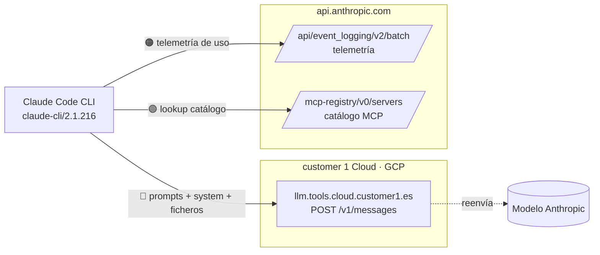
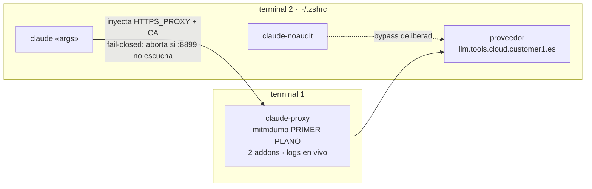
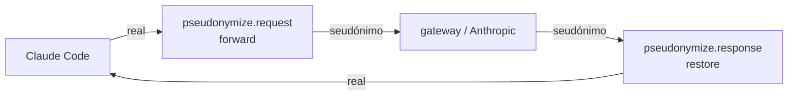

# 🔍 Auditoría de payload enviado a Anthropic

## 🤔 ¿Qué hago? ¿Cómo lo hago? ¿Y para qué lo hago?

- **¿Qué hago?** Capturo el cuerpo exacto de cada petición HTTPS que Claude Code emite hacia la API de Anthropic (y hacia el gateway LLM corporativo), para poder auditar —desde una óptica de privacidad y compliance— qué información sale del equipo.
- **¿Cómo lo hago?** Interceptando el tráfico TLS con un proxy `mitmproxy` local + un addon Python ([`src/anthropic_payload_capture.py`](../src/anthropic_payload_capture.py)) que vuelca cada request a fichero JSON, **redactando los secretos** (API key / `Authorization`).
- **¿Para qué lo hago?** Para documentar la frontera de datos real: qué se envía, a qué host, y qué contiene (system prompt, herramientas, contenido de ficheros del repo, telemetría).

---

## 📦 Ubicación y layout (proyecto standalone)

Este tooling vive de forma independiente en **`klaus-proxy-local`**:

```text
klaus-proxy-local/
├── src/         # addons + CLIs (capture, pseudonymize, verify, analyze, cleanup)
├── tests/       # suite pytest espejo (157 tests)
├── docs/        # este doc + MANIFIESTO + MANUAL + plantilla del LaunchAgent
└── captures/    # DATOS SENSIBLES (gitignored): original/, sent/, .pseudonym_vault.json
```

- **`src/` + `tests/` + `docs/` se versionan; `captures/` NO** (gitignored — prompts,
  contenido real de ficheros y el vault real↔seudónimo nunca salen a git).
- **Anclaje de rutas:** las capturas y el vault se resuelven relativas al tooling
  (`Path(__file__).parents[1]/captures/`), mientras que la **raíz del proyecto
  auditado** (palanca de rutas + identidad git) sale del **cwd** del proceso
  `mitmdump` (o de `ANTHROPIC_PSEUDO_PROJECT_ROOT`). Así el tooling audita cualquier
  repo sin acoplarse a él.

---

## 🧭 Hallazgo principal: hay DOS destinos, no uno

La inferencia **no** viaja directamente a `api.anthropic.com`. Claude Code (v2.1.216) reparte el tráfico así:

| Destino | Endpoint | Qué contiene | Sensibilidad |
| --- | --- | --- | --- |
| **`llm.tools.cloud.customer1.es`** (gateway corporativo, GCP `203.0.113.10`) | `POST /v1/messages?beta=true` | **La inferencia real**: system prompt, definición de las 25 tools, historial de mensajes, y **todo el contenido de ficheros que se lean/editen**. `model=claude-opus-4-8`, `max_tokens=64000`. | 🔴 Alta |
| `api.anthropic.com` | `POST /api/event_logging/v2/batch` | Telemetría de uso (eventos del CLI). ~226 KB. Rutas y contenido **hasheados**; comandos y prompts reducidos a **longitud/tipo**. Ver [análisis detallado](telemetria-anthropic-event-logging.md). | 🟢 Baja |
| `api.anthropic.com` | `GET /mcp-registry/v0/servers` | Lookup del catálogo de servidores MCP (sin datos del usuario). | 🟢 Baja |

> **Implicación de compliance:** los prompts y el contenido del repositorio salen hacia el **gateway de customer 1**, que actúa como intermediario y reenvía a Anthropic (API estilo Anthropic, cabecera `anthropic-version: 2023-06-01`). La telemetría, en cambio, va **directa** a Anthropic. Cualquier DPA/evaluación de privacidad debe cubrir ambos flujos por separado.

> 📡 **Telemetría — veredicto (2026-07-24):** analizada en detalle en [telemetria-anthropic-event-logging.md](telemetria-anthropic-event-logging.md). Sensibilidad **baja** (rutas/contenido hasheados; prompts/comandos reducidos a metadatos). Único dato identificativo: `device_id` + fingerprint de `env`. Decisión: **documentar y no bloquear**.



---

## 🛠️ Runbook — cómo reproducir la captura

### Requisitos
- `mitmproxy` (instalado vía Homebrew: `brew install mitmproxy`).
- CA de mitmproxy generada en `~/.mitmproxy/mitmproxy-ca-cert.pem` (se crea en el primer arranque).

### Pasos

1. **Arrancar el proxy con el addon:**
   ```bash
   mitmdump -s src/anthropic_payload_capture.py -p 8899
   ```

2. **Enrutar Claude Code a través del proxy** (en OTRA terminal). Node no usa el keychain del sistema, de ahí `NODE_EXTRA_CA_CERTS`:
   ```bash
   HTTPS_PROXY=http://127.0.0.1:8899 \
   HTTP_PROXY=http://127.0.0.1:8899 \
   NODE_EXTRA_CA_CERTS=~/.mitmproxy/mitmproxy-ca-cert.pem \
   claude -p "tu prompt de prueba"
   ```
   > ⚠️ La sesión de Claude Code que solicita la auditoría **no puede autocapturarse** (su request ya está en vuelo). Usa siempre un proceso `claude` nuevo por el proxy.

3. **Revisar la evidencia**: cada request deja un par de ficheros con el mismo
   nombre en dos subdirectorios espejo de `captures/`:
   - `sent/` — el cuerpo **seudonimizado** que realmente salió del equipo.
   - `original/` — los **mismos datos antes** de seudonimizar (con los secretos
     Tier-1 igualmente redactados). Comparación directa: `diff original/X sent/X`.

### 🚀 Arranque — modelo MANUAL en primer plano (actual)

El modelo activo es **manual**: el proxy corre **en primer plano** en una terminal
dedicada (logs de cada petición en vivo) y `claude` se enruta por él de forma
**fail-closed**. Tres funciones de shell en `~/.zshrc` (local, no versionado):

```text
claude  →  mitmproxy 127.0.0.1:8899 (seudonimiza + captura)  →  proveedor
```

| Comando | Efecto |
| --- | --- |
| `claude-proxy [repo]` | Arranca `mitmdump` **en PRIMER PLANO** en ESTA terminal (addons `pseudonymize` + `capture` en `:8899`, `ANTHROPIC_PSEUDO_WORD_LITERALS` seteado). Hace `cd` al **repo auditado** (arg opcional; por defecto el `$PWD` actual) para que la palanca de rutas y la identidad git operen sobre él. Los addons viven en el tooling y las capturas/vault en `<tool>/captures/`, con independencia del cwd. Los logs de flujo salen aquí en tiempo real; **Ctrl-C** lo detiene. Aborta si ya hay algo escuchando en `:8899`. |
| `claude [args…]` | `claude` **siempre** enrutado por el proxy. **Solo enruta**: NO levanta el proxy. Fail-closed — si `:8899` no escucha o falta la CA, **aborta** (no deja salir tráfico sin auditar). |
| `claude-noaudit [args…]` | Bypass deliberado: `claude` directo al gateway, **sin** auditar (`command claude`). |

> Flujo de uso: **terminal 1** → `claude-proxy` (déjala abierta, logs en vivo);
> **terminal 2** → `claude` (va siempre por el proxy).

**Credenciales — las funciones NO las tocan.** `ANTHROPIC_BASE_URL` y
`ANTHROPIC_AUTH_TOKEN` (el proveedor real y su token) **se heredan del entorno**
del shell; las funciones solo anteponen
`HTTPS_PROXY`/`HTTP_PROXY`/`NODE_EXTRA_CA_CERTS`. No viven en ningún fichero de
arranque ni las escribe el tooling: no hay secretos en disco por parte de la
auditoría. Si en una terminal nueva no están exportadas, hay que exportarlas antes.



> ⚠️ **Fail-closed:** si borras la CA o el proxy no está en marcha, `claude` se
> negará a ejecutarse (para no filtrar inferencia sin auditar). Usa `claude-noaudit`
> solo cuando quieras saltarte la auditoría a propósito.

> ℹ️ La sesión de Claude Code que pide la auditoría **no puede autocapturarse**
> (su request ya está en vuelo). Audita siempre un proceso `claude` **nuevo**
> lanzado por el proxy.

> 🔁 **Hot-reload de addons:** `mitmproxy` recarga en caliente los `.py` pasados con
> `-s` al guardarlos — **no hace falta reiniciar** `claude-proxy` para aplicar cambios
> de código. (Útil: si esta propia sesión sale por `:8899`, matar el proxy la tumbaría.)

### 🛡️ Alternativa opcional — LaunchAgent (actualmente DESHABILITADA)

> ⚠️ **No es el modelo activo.** Se revirtió al modelo manual de arriba para ver los
> logs en vivo. El plist está en
> `~/Library/LaunchAgents/com.customer1.anthropic-audit-proxy.plist.disabled` y las
> funciones `claude-audit` / `claude-audit-stop` / `claude-audit-restart` **se
> eliminaron**. Esta sección se conserva solo como procedimiento **reversible** de
> reactivación.

Con LaunchAgent el proxy se gestionaría como servicio de macOS (`launchd`) con
`RunAtLoad` + `KeepAlive` (arranca al iniciar sesión y se reinicia si cae),
`WorkingDirectory` = repo **AUDITADO** (de ahí sale `project_root()` para la
palanca de rutas y la identidad git; las capturas y el vault cuelgan del tooling,
no del cwd) y log en `~/.claude/mitmproxy-audit.log`.

**Reactivar** (ejecuta desde la raíz de `klaus-proxy-local`, a partir de la
plantilla versionada
[`com.customer1.anthropic-audit-proxy.plist.template`](./com.customer1.anthropic-audit-proxy.plist.template)):

```bash
# {{TOOL}} = raíz de klaus-proxy-local (este repo); {{AUDIT_REPO}} = proyecto a auditar.
AUDIT_REPO="${AUDIT_REPO:-$HOME/proyectos/customer1-ecosistema1}"   # ajústalo al repo que auditas
sed -e "s#{{MITMDUMP}}#$(which mitmdump)#g" \
    -e "s#{{TOOL}}#$PWD#g" \
    -e "s#{{AUDIT_REPO}}#$AUDIT_REPO#g" \
    -e "s#{{HOME}}#$HOME#g" \
    docs/com.customer1.anthropic-audit-proxy.plist.template \
    > ~/Library/LaunchAgents/com.customer1.anthropic-audit-proxy.plist

# Carga y arranca el servicio (uid del usuario = `id -u`):
launchctl bootstrap gui/$(id -u) ~/Library/LaunchAgents/com.customer1.anthropic-audit-proxy.plist
launchctl enable   gui/$(id -u)/com.customer1.anthropic-audit-proxy

# Verifica:
launchctl print gui/$(id -u)/com.customer1.anthropic-audit-proxy | grep -E "state|pid"
lsof -nP -iTCP:8899 -sTCP:LISTEN
```

Con el LaunchAgent en marcha, la función `claude()` de `~/.zshrc` (la misma del
modelo manual: **solo enruta**, fail-closed) encontraría el proxy ya escuchando en
`:8899` y saldría por él sin más. Para volver a deshabilitarlo:

```bash
launchctl bootout gui/$(id -u)/com.customer1.anthropic-audit-proxy
mv ~/Library/LaunchAgents/com.customer1.anthropic-audit-proxy.plist{,.disabled}
```

> ℹ️ También con LaunchAgent, la sesión que pide la auditoría **no puede
> autocapturarse**: audita un proceso `claude` **nuevo**.

### 🧪 Secuencia de primera prueba (de principio a fin)

En **dos terminales** que ya tengan exportadas tus credenciales del proveedor
(`ANTHROPIC_BASE_URL` + `ANTHROPIC_AUTH_TOKEN` — las funciones **no** las gestionan):

```bash
# Terminal 1 — arranca el proxy en primer plano (déjala abierta, logs en vivo):
claude-proxy

# Terminal 2 — lanza claude enrutado por el proxy (fail-closed):
claude -p "responde solo con la palabra: pong"

# Terminal 2 — verifica en un comando lo que salió del equipo:
python3 src/anthropic_capture_verify.py
```

Esperado: `✅ TODO CORRECTO` con destino = gateway, cabeceras redactadas y sin fugas.

> ⚠️ La sesión de Claude Code que pide la auditoría **no puede autocapturarse**:
> lanza siempre un proceso `claude` **nuevo** por el proxy, que sí es auditable.

### ✅ Verificación en un comando: `anthropic-capture-verify`

Después de una prueba, en lugar de abrir el `.json` a mano, un único comando
comprueba la **última captura de inferencia** (`/v1/messages` → proveedor) y
emite veredicto. Opera sobre `sent/` (lo que **realmente salió**); verificar
`original/` daría FAIL de fuga a propósito, porque ahí los datos reales están
por diseño:

```bash
python3 src/anthropic_capture_verify.py
```

Verifica las **tres garantías** de la auditoría y avisa si la seudonimización no actuó:

| Comprobación | Qué exige | Nivel si falla |
| --- | --- | --- |
| 🎯 **Destino** | La inferencia fue a `llm.tools.cloud.customer1.es` (no directa a Anthropic) | ❌ FAIL |
| 🔑 **Secretos redactados** | Cabeceras `Authorization`/`x-api-key`/… = `«REDACTED»` y **cero** tokens `sk-…`/`Bearer …` en claro | ❌ FAIL |
| 🕵️ **Sin fugas en claro** | Ningún **valor real** del vault (rutas, usuario, identidad git, org/repo, emails, IPs) aparece en el cuerpo | ❌ FAIL (⚠️ WARN si el valor es de baja sensibilidad: loopback/DNS público) |
| 🕵️ **Seudonimización activa** | Se detecta ≥1 seudónimo en el cuerpo (prueba de que reescribió) | ⚠️ WARN (normal si el prompt no tenía datos sensibles) |

- **Selección automática:** elige la última captura que sea inferencia real al
  proveedor. La telemetría a `api.anthropic.com` (que es la más reciente a menudo)
  se ignora salvo que pases `--any`.
- **No re-expone secretos:** si detecta una fuga, muestra el **seudónimo** esperado
  y el valor real **enmascarado** (`/U•••••••••••b`), nunca el valor completo.
- **Código de salida:** `0` todo correcto · `1` hay fallos · `2` no hay capturas
  (útil para encadenar en cron/CI).

| Flag | Efecto | Default |
| --- | --- | --- |
| `[fichero]` | Verifica una captura concreta en vez de la última inferencia | — |
| `--dir PATH` | Directorio de capturas | `captures/sent/` (con fallback al histórico plano) |
| `--vault PATH` | Ruta del vault de seudonimización | `captures/.pseudonym_vault.json` |
| `--provider-host H` | Host esperado del proveedor | `llm.tools.cloud.customer1.es` |
| `--any` | Verifica la última captura aunque sea telemetría/no-inferencia | off |

> ⚠️ **Necesitas capturas primero.** Si no existe ninguna, el comando devuelve `2`
> con el aviso *"¿Arrancaste `claude-proxy` y lanzaste `claude` por él?"*. Para
> generarlas hay que tener el proxy en marcha (`claude-proxy`, ver arriba) y lanzar
> `claude` por él; el proxy manual equivale a:
> ```bash
> mitmdump -s src/anthropic_payload_pseudonymize.py \
>          -s src/anthropic_payload_capture.py -p 8899
> ```

> 🧪 Tests en [`tests/test_anthropic_capture_verify.py`](../tests/test_anthropic_capture_verify.py) (30):
> selección de inferencia vs telemetría, destino, redacción de cabeceras/token,
> detección de fugas (alta/baja sensibilidad), enmascarado sin re-exposición,
> seudonimización presente/ausente y códigos de salida del CLI.
> Ejecuta: `pytest tests/test_anthropic_capture_verify.py`.

### 🔬 Validación diferencial por pares: `anthropic-pair-verify`

El verificador de arriba compara una captura contra el **vault**. Tiene un punto
ciego: si un identificador **nunca se seudonimizó** (p.ej. faltaba en
`ANTHROPIC_PSEUDO_WORD_LITERALS`), tampoco entró al vault, así que **no hay valor
que buscar** y la fuga pasa en silencio — es el fallo que produjo las fugas de
alta sensibilidad del barrido histórico.

`anthropic_pair_verify.py` cierra ese hueco **sin depender del vault**: empareja
cada `original/<n>` con su `sent/<n>` (mismo nombre) y comprueba que **ningún dato
sensible del original sobrevive verbatim en el sent**, derivando "lo sensible" del
propio original + el entorno + los mismos patrones del seudonimizador.

```bash
python3 src/anthropic_pair_verify.py               # barrido de todos los pares
python3 src/anthropic_pair_verify.py <nombre.json> # un par concreto
python3 src/anthropic_pair_verify.py --survivors   # tabla de slugs a revisar
```

**Capas que deciden el veredicto (exit code):**

| Comprobación | Qué exige | Nivel si falla |
| --- | --- | --- |
| 🔗 **Emparejamiento** | Variantes `original`/`sent` coherentes | ⚠️ WARN |
| 🕵️ **Fugas en claro (HARD)** | Ningún valor sensible del original reaparece en el sent: emails, IPv4 (no loopback), rutas home/proj, usuario/identidad git, word-literals + org/repo del remote, y valores del vault | ❌ FAIL |
| 🔑 **Secretos redactados** | Ningún secreto Tier-1 (PEM/AWS/GitHub/JWT/…) viaja **en claro** en el sent (deben ir `«REDACTED:…»`) | ❌ FAIL |

- **Código de salida:** `0` sin fugas · `1` alguna fuga HARD (o WARN con
  `--fail-on-warn`) · `2` no hay pares. Gateable en CI (formaliza el caso **T7**
  del [plan de pruebas de control](plan-pruebas-control.md)).
- **No re-expone valores:** las fugas HARD se reportan **enmascaradas** (`mask`),
  agrupadas por categoría; nunca el valor completo.

**Modo descubrimiento `--survivors` (informativo, NO veredicto):** emite una tabla
global de *slugs con guion* (`org-repo`) que sobreviven de original a sent en el
**contenido de los mensajes** y no son vocabulario conocido (excluye UUIDs, fechas,
flags `claude-*`/`anthropic-*`, cabeceras y andamiaje de la API). Es el apoyo para
descubrir qué identificadores añadir a `ANTHROPIC_PSEUDO_WORD_LITERALS`
(pre-flight **P4**). Nunca afecta al exit code. Afina el umbral con `--min-count N`.

| Flag | Efecto | Default |
| --- | --- | --- |
| `[nombre]` | Verifica un par concreto en vez de todos | — |
| `--original-dir` / `--sent-dir` | Directorios del par | `captures/original/` · `captures/sent/` |
| `--vault PATH` | Ruta del vault | `captures/.pseudonym_vault.json` |
| `--verbose` | Imprime también los pares sin hallazgos | off |
| `--fail-on-warn` | El exit code también falla con WARN (auditoría estricta) | off |
| `--survivors` | Modo descubrimiento (tabla de slugs candidatos) | off |
| `--min-count N` | En `--survivors`, umbral mínimo de pares por slug | `1` |

> 🧪 Tests en [`tests/test_anthropic_pair_verify.py`](../tests/test_anthropic_pair_verify.py) (26):
> emparejado y huérfanos, cada categoría HARD/SECRET con y sin fuga, `_MIN_LEAK_LEN`,
> `message_text` (excluye system/tools/cabeceras), `collect_survivors`, códigos de
> salida y la regresión del hallazgo (slug de otro proyecto no seudonimizado).
> Ejecuta: `pytest tests/test_anthropic_pair_verify.py`.

> 🧭 **Cuándo usar cuál:** `anthropic-capture-verify` para un chequeo rápido de la
> última inferencia (destino + secretos + fugas de vault); `anthropic-pair-verify`
> para el **barrido de control** independiente del vault sobre todo el histórico de
> pares. Se complementan.

### Configuración por variables de entorno

| Variable | Efecto | Default |
| --- | --- | --- |
| `ANTHROPIC_CAPTURE_HOSTS` | Lista de hosts a capturar (coma-separada) | `api.anthropic.com,llm.tools.cloud.customer1.es` |
| `ANTHROPIC_CAPTURE_REDACT` | `0` para capturar secretos tal cual (⚠️ no versionar) | `1` (redacta) |
| `ANTHROPIC_CAPTURE_DIR` | Directorio **base** de salida (los pares caen en sus subdirs `sent/` y `original/`) | `captures/` |

---

## 🕵️ Seudonimización bidireccional (opcional)

Además de **observar**, el proxy puede **reescribir en vuelo** los datos sensibles del cuerpo por seudónimos estables, y **revertirlos en la respuesta** para que las tool calls sigan operando sobre valores reales. Addon: [`src/anthropic_payload_pseudonymize.py`](../src/anthropic_payload_pseudonymize.py).

> 🔗 **El seudonimizador y la captura cooperan por `flow.metadata`.** El seudonimizador (que corre ANTES) deja en el flujo el cuerpo `original` (datos reales, secretos Tier-1 ya redactados) además de reescribir la request. La captura (DESPUÉS) graba el par: `sent/` desde la request ya reescrita, `original/` desde el cuerpo del `metadata`. Si el seudonimizador está deshabilitado, `original` == `sent` y `pseudonymized=false`.

> 🔧 **Transformación estructural (no regex sobre JSON crudo):** el cuerpo se parsea como JSON y solo se seudonimizan los **valores string**, re-serializando después. Así el encoder re-escapa comillas y backslashes y es **imposible romper el JSON** (una sustitución sobre el JSON ya serializado podía comerse el `\` de un `\"` → `400 Invalid JSON`; corregido). Si el cuerpo no es JSON, cae a texto plano.



- **Qué seudonimiza (por defecto, autodetectado):** raíz del repo y `$HOME` (**palanca de rutas**), usuario del SO e identidad git (`user.name`/`user.email`), org y nombre de repo del `remote origin`, y por regex emails e IPv4.
- **Secretos (Tier 1) — redacción IRREVERSIBLE:** si un `Read`/`Bash` arrastra una credencial, el **cuerpo** no está redactado como las cabeceras. Estos patrones la sustituyen por un placeholder fijo `«REDACTED:label»` que **no entra al vault** (no se revierte — el modelo casi nunca necesita el valor real, y así el vault no acumula secretos):

  | Patrón | Detecta |
  | --- | --- |
  | `private-key` | Bloques `-----BEGIN … PRIVATE KEY-----` |
  | `aws-access-key` | `AKIA…` (16) |
  | `github-token` | `ghp_/gho_/ghu_/ghs_/ghr_…` |
  | `google-api-key` | `AIza…` (35) |
  | `slack-token` | `xox[baprs]-…` |
  | `jwt` | `eyJ….….…` |
  | `secret-kv` ⚙️ | `secret/token/password/api_key… = valor` (redacta solo el valor). **Opt-in** (`ANTHROPIC_PSEUDO_SECRET_KV=1`): sobre código mis-dispara, así que solo para auditar un `.env`/secretos concreto. Lleva lookahead de delimitador para no confundir `os.getenv("X")` con una credencial. |

- **Literales con frontera de palabra (Tier 2) — reversibles:** términos cortos/ambiguos (códigos de cliente `orgcode1`/`orgcode2`, IDs de proyecto cloud como `orgcode3`, dominios corporativos) que **no** pueden ir por substring porque corromperían palabras (`orgcode2` dentro de `HTTPS`). Se sustituyen solo con frontera alfanumérica y **sí** se revierten. Org/repo del remote se autodetectan; el resto se añade por `ANTHROPIC_PSEUDO_WORD_LITERALS`.
- **Palanca de rutas:** una ruta como `/home/localuser/proyectos/customer1-ecosistema1/dashboard/app.py` sale como `/proj_xxxxxxxx/dashboard/app.py` — se oculta home + usuario + nombre de proyecto pero se **conserva la estructura relativa y la extensión**, y al volver se reconstruye la ruta absoluta real. Incluso una ruta que el modelo **invente** bajo el seudónimo (`/proj_xxxx/docs/nuevo.md`) se traduce a la ruta real antes de que el CLI la ejecute.
- **Vault:** mapa bidireccional `real↔seudónimo` (hash con sal, estable y no reversible sin el vault). Se persiste en `captures/.pseudonym_vault.json`. ⚠️ **Es el fichero más sensible de la auditoría — contiene los valores reales.** Vive en el directorio gitignored; nunca se versiona.

### Ejecución (seudonimizador ANTES de la captura)

El orden importa: el seudonimizador debe reescribir **antes** de que la captura grabe, para que la evidencia refleje lo que *realmente* sale del equipo.

```bash
mitmdump -s src/anthropic_payload_pseudonymize.py \
         -s src/anthropic_payload_capture.py -p 8899
```

### Configuración por entorno

| Variable | Efecto | Default |
| --- | --- | --- |
| `ANTHROPIC_PSEUDO_ENABLE` | Interruptor general | `1` |
| `ANTHROPIC_PSEUDO_PATHS` | Palanca de rutas de ficheros | `1` |
| `ANTHROPIC_PSEUDO_REGEX` | Detección email / IPv4 | `1` |
| `ANTHROPIC_PSEUDO_SECRETS` | Detectores precisos de secretos (PEM/AWS/GitHub/...) | `1` |
| `ANTHROPIC_PSEUDO_SECRET_KV` | Matcher genérico `clave=valor` (ruidoso sobre código) | `0` |
| `ANTHROPIC_PSEUDO_LITERALS` | Literales extra por substring (coma-separados) | — |
| `ANTHROPIC_PSEUDO_WORD_LITERALS` | Literales con frontera de palabra: `orgcode1,orgcode2,orgcode3,customer1.es` | — |
| `ANTHROPIC_PSEUDO_PATHS_EXTRA` | Prefijos de ruta extra `"/ruta=label,..."` | — |
| `ANTHROPIC_PSEUDO_SALT` | Sal del hash de seudónimos | `mo-ecosistema1-audit` |
| `ANTHROPIC_PSEUDO_VAULT` | Ruta del vault | `captures/.pseudonym_vault.json` |

> ⚠️ **Limitación conocida (streaming):** esta versión procesa la respuesta **completa** (mitmproxy bufferiza por defecto), lo que es correcto para las tool calls pero retrasa el render token-a-token. La variante en streaming (reemplazo con buffer de arrastre sobre SSE) queda como mejora posterior.

> Tests en [`tests/test_anthropic_payload_pseudonymize.py`](../tests/test_anthropic_payload_pseudonymize.py) (43): round-trip forward/restore, longest-match-first, palanca de rutas, regex, idempotencia, persistencia del vault, redacción irreversible de secretos, word-literals con frontera (no corrompen `HTTPS`/`COMMIT`), transformación estructural JSON (regresión del `400`) y `secret-kv` sin morder `os.getenv(...)`.

---

## 🎨 Logs coloreados

Los dos addons colorean sus líneas de log **por semántica**, para escanear en vivo de un vistazo qué está pasando:

| Color | Nivel | Cuándo | Ejemplo |
| --- | --- | --- | --- |
| 🟢 Verde | `ok` | Se ejecutó una acción de auditoría real: el cuerpo se **reescribió** (dato sensible neutralizado) o la respuesta se **revirtió** | `[anthropic-pseudo] request POST /v1/messages seudónimos=53`<br>`[anthropic-capture] POST /v1/messages → sent/… (pseudonymized=True)` |
| ⚪ Neutro | — | La request salió pero **no había nada que seudonimizar** (p. ej. telemetría `event_logging`). No es un problema — ver [telemetría](telemetria-anthropic-event-logging.md) | `[anthropic-capture] POST /api/event_logging/v2/batch → sent/… (pseudonymized=False)` |
| 🟡 Amarillo | `warn` | Degradación que **no es fuga**: no se pudo persistir el vault (la request ya salió seudonimizada) o no se pudo revertir la response (el CLI puede ver seudónimos) | `[anthropic-pseudo] WARN no pude persistir el vault: … (la request va seudonimizada)`<br>`[anthropic-pseudo] WARN no pude leer la response de /… — no se revierte` |
| 🔴 Rojo | `error` | Fallo serio: request **bloqueada en fail-closed** (no se pudo seudonimizar → no salió) o fallo al **escribir la evidencia** en disco | `[anthropic-pseudo] BLOQUEADA (fail-closed) POST /v1/messages: …`<br>`[anthropic-capture] ERROR escribiendo evidencia 20260724_130145_… : …` |

> 💡 El neutro (sin color) para `pseudonymized=False` es **deliberado**: la telemetría domina el tráfico y nunca contiene rutas/identidad, así que colorearla llamaría la atención sin motivo. El amarillo se reserva a degradaciones sin fuga; lo que sí pone en riesgo un dato se **bloquea** (rojo), no se avisa.

### Cuándo se colorea

El coloreado se activa **solo si la salida es una terminal** (`sys.stdout.isatty()`), de modo que si rediriges el log a un fichero o lo pasas por un pipe (`claude-proxy | tee audit.log`) **no se cuelan secuencias ANSI** en la evidencia. Además:

| Variable | Efecto |
| --- | --- |
| `NO_COLOR` (presente, cualquier valor) | Desactiva el color (convención [no-color.org](https://no-color.org)) |
| `ANTHROPIC_LOG_COLOR=1` | **Fuerza** color aunque no sea TTY (útil para `less -R`) |
| `ANTHROPIC_LOG_COLOR=0` | Desactiva color aunque sea TTY |

El helper `colorize()` / `color_enabled()` es una función pura (misma implementación autocontenida en ambos addons), con tests en `test_anthropic_payload_capture.py` y `test_anthropic_payload_pseudonymize.py`.

### 🚧 Fail-closed: si no se puede seudonimizar, no sale

El seudonimizador está diseñado para **fallar cerrado**: si cualquier paso de la seudonimización de una request a un host objetivo lanza una excepción (no se puede leer/decodificar el cuerpo, reescribirlo, etc.), la request se **aborta localmente** y **no se envía a Anthropic**.

- Técnicamente: `request()` envuelve todo el trabajo en un `try`; ante excepción, `_fail_closed()` fija `flow.response` a un **502** con un mensaje explicativo (mitmproxy responde **sin contactar con el servidor**). Si ni eso se puede, `flow.kill()`.
- **Por qué:** sin esta red, una excepción en un hook de mitmproxy se **loguea pero el flujo continúa con el cuerpo original** — es decir, saldría **sin seudonimizar** (fail-**open**). El fail-closed convierte ese borde silencioso en un bloqueo ruidoso (línea 🔴 roja).
- **Evidencia:** la request bloqueada se marca con `blocked: true` en el par `sent`/`original`. El cuerpo de `sent/` es un **marcador** (`«BLOCKED: …»`), no el cuerpo real — porque no salió nada. El cuerpo real (con secretos redactados) queda en `original/` para diagnóstico.
- **Alcance:** solo aplica a la **request** (hacia Anthropic). En la **response** (hacia el CLI) NO se bloquea: no poder revertir seudónimos no es una fuga, así que se avisa en 🟡 amarillo y se deja pasar (bloquearla solo rompería la sesión).

> En la práctica este bloqueo casi nunca se dispara: `get_text`/`pseudonymize_body` no lanzan sobre el JSON bien formado que envía Claude Code. Es una **red de seguridad**, no un camino habitual.

---

## 🔒 Tratamiento de secretos

Por defecto se **redactan** (`«REDACTED»`) las cabeceras `x-api-key`, `Authorization`, `anthropic-organization-id`, `cookie`. Esto hace que los ficheros de evidencia sean seguros de versionar. El campo `secrets_redacted: true` del JSON deja constancia de que la redacción se aplicó.

## 🗂️ Nomenclatura y estructura de ficheros

Cada request genera un **par** de evidencias con **idéntico nombre** en dos
subdirectorios espejo, de modo que se compare al instante qué se *iba* a enviar
frente a lo que se envió:

```
captures/
├── original/   YYYYMMDD_HHMMSS_anthropic_payload.json   # datos reales (secretos Tier-1 redactados)
└── sent/       YYYYMMDD_HHMMSS_anthropic_payload.json   # cuerpo seudonimizado — lo que salió
```

(Con sufijo `_N` ante colisiones dentro del mismo segundo; el contador se
sincroniza sobre ambos subdirectorios para que el par nunca se desalinee.)

Cada registro lleva `variant` (`original`|`sent`), `pseudonymized` (bool) y
`counterpart` (el nombre del fichero pareja). Comparación:

```bash
diff captures/original/20260722_090605_anthropic_payload.json \
     captures/sent/20260722_090605_anthropic_payload.json
```

> ⚠️ **`original/` es tan sensible como el vault**: contiene rutas, identidad,
> prompts y contenido de ficheros en claro. Vive en el directorio gitignored y
> **jamás** se versiona. Las credenciales Tier-1 (claves privadas, tokens
> AWS/GitHub/JWT) sí se redactan también aquí: nunca caen a disco.

> 🕵️ **`sent/` seudonimiza también `url`/`host`/`path` y valores de cabecera**
> (no solo el cuerpo), reutilizando el vault ya poblado por el cuerpo — sin
> acuñar seudónimos nuevos. Así el subdominio del gateway corporativo no se
> filtra en la evidencia. En `original/` esos campos van reales. El verificador
> acepta el host del proveedor tanto real como seudonimizado.

> ℹ️ Las capturas **anteriores** a este split viven planas en `captures/`
> (sin par `original/`). El verificador cae a ellas si `sent/` aún está vacío.

## 🧰 Scripts del tooling

Cinco scripts **versionados** en `src/`, cada uno con su test espejo en
`tests/` (lo que se versiona es el código; los datos de `captures/` no):

| Script | Rol | Doc |
| --- | --- | --- |
| [`anthropic_payload_capture.py`](../src/anthropic_payload_capture.py) | Addon de **captura**: graba el par `original/`+`sent/` de cada request. | este documento |
| [`anthropic_payload_pseudonymize.py`](../src/anthropic_payload_pseudonymize.py) | Addon de **seudonimización** bidireccional (forward/restore). | §"Seudonimización bidireccional" |
| [`anthropic_capture_verify.py`](../src/anthropic_capture_verify.py) | **Verificador** de una captura (destino, secretos, fugas). | §"Verificación en un comando" |
| [`anthropic_pair_verify.py`](../src/anthropic_pair_verify.py) | **Validador diferencial** por pares `original`↔`sent` (fugas independientes del vault + descubrimiento de slugs). | §"Validación diferencial por pares" |
| [`anthropic_payload_analyze.py`](../src/anthropic_payload_analyze.py) | **Analizador**: vuelca todo lo que sale al modelo (system, tools, historial, ficheros embebidos). | [`MANIFIESTO_ficheros_embebidos.md`](MANIFIESTO_ficheros_embebidos.md) |
| [`anthropic_artifacts_cleanup.py`](../src/anthropic_artifacts_cleanup.py) | **Limpieza + hardening** del riesgo *data-at-rest* (artefactos en claro que Claude Code deja en disco). | [`MANUAL_limpieza_hardening.md`](MANUAL_limpieza_hardening.md) |

## 🧪 Tests

Espejo en `tests/`. La configuración de pytest vive en `pyproject.toml`
(`[tool.pytest.ini_options]`); las dependencias de test (`pytest`, `pytest-cov`)
se instalan con `pip install -e ".[dev]"`. Ejecuta toda la suite con `pytest`:

| Test | Nº | Cubre |
| --- | --- | --- |
| [`test_anthropic_payload_capture.py`](../tests/test_anthropic_payload_capture.py) | 27 | redacción, parseo de body, nombre de fichero, filtro de host |
| [`test_anthropic_payload_pseudonymize.py`](../tests/test_anthropic_payload_pseudonymize.py) | 43 | round-trip forward/restore, palanca de rutas, word-literals, JSON estructural, secret-kv |
| [`test_anthropic_capture_verify.py`](../tests/test_anthropic_capture_verify.py) | 30 | selección inferencia/telemetría, destino, redacción, fugas, códigos de salida |
| [`test_anthropic_pair_verify.py`](../tests/test_anthropic_pair_verify.py) | 26 | emparejado/huérfanos, categorías HARD/SECRET, `message_text`, `collect_survivors`, códigos de salida, regresión del hallazgo |
| [`test_anthropic_artifacts_cleanup.py`](../tests/test_anthropic_artifacts_cleanup.py) | 22 | dry-run, contención de rutas, symlinks protegidos, idempotencia |
| [`test_anthropic_payload_analyze.py`](../tests/test_anthropic_payload_analyze.py) | 9 | ayuda/uso del CLI, detección de payload, summarize, render_dump, análisis de fichero |

> Nota: los linters/formateadores están **fijados** en `pyproject.toml`
> (`ruff==0.16.0`, `black==25.11.0`) para que el formato sea reproducible entre
> local y CI. La suite completa (157 tests de auditoría + 1 placeholder del
> paquete base = **158**) corre en el job `Test` del CI sobre Python 3.10/3.11/3.12.
