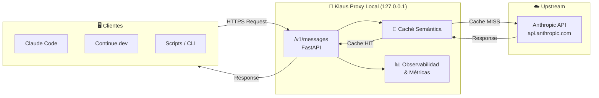

# 🏗️ Arquitectura — Klaus Proxy Local

## 🤔 ¿Qué hago? ¿Cómo lo hago? ¿Y para qué lo hago?

### ¿Qué hago?
**Klaus Proxy Local** es un proxy HTTP que se interpone entre cualquier cliente compatible con la API de Anthropic (Claude Code, Continue.dev, IDEs, scripts) y el endpoint real `api.anthropic.com`. Intercepta, inspecciona y retransmite las peticiones, añadiendo capas de observabilidad, caché semántica y control de flujo que la API oficial no ofrece.

### ¿Cómo lo hago?
El proxy expone un servidor **FastAPI** en local (`127.0.0.1`) que replica la interfaz de la Anthropic Messages API (`/v1/messages`). Cada petición entrante es:
1. Validada y opcionalmente enriquecida (contexto, system prompt)
2. Comprobada contra la caché semántica local (si hay coincidencia, responde sin llamar a Anthropic)
3. Si no hay caché, retransmitida a `api.anthropic.com` mediante **httpx** con soporte de streaming
4. La respuesta se almacena en caché y se devuelve al cliente

### ¿Y para qué lo hago?
- **Reducir costes**: las respuestas cacheadas no consumen tokens de Anthropic
- **Observabilidad local**: métricas de uso, latencia y coste sin depender de servicios externos
- **Control**: filtrado de requests, rate limiting local, logging completo
- **Ecosistema K***: es la capa de transporte inteligente sobre la que se construyen los demás componentes del ecosistema

---

## 🗺️ Diagrama de arquitectura



---

## 📦 Estructura del paquete

```
Klaus-proxy-local/
├── src/
│   └── Klaus_proxy_local/
│       ├── __init__.py       # versión del paquete
│       └── main.py           # entry point del servidor
├── tests/
│   ├── __init__.py
│   └── test_placeholder.py   # tests unitarios (en expansión)
├── docs/                     # documentación por componente
│   ├── architecture.md       # este fichero
│   ├── ci-cd.md
│   ├── security.md
│   └── setup.md
├── pyproject.toml            # configuración del paquete y herramientas
└── .github/
    ├── workflows/
    │   ├── ci.yml            # lint + test matrix
    │   └── codeql.yml        # SAST automático
    └── dependabot.yml        # actualizaciones de dependencias
```

---

## 🧩 Componentes planificados

| Componente | Módulo | Estado |
| --- | --- | --- |
| 🌐 Servidor proxy | `proxy/main.py` | 🔴 Por implementar |
| 💾 Caché semántica | `proxy/cache.py` | 🔴 Por implementar |
| 📊 Observabilidad | `proxy/analytics.py` | 🔴 Por implementar |
| 🔑 Auth & rate limit | `proxy/auth.py` | 🔴 Por implementar |
| 🔄 Cliente upstream | `proxy/client.py` | 🔴 Por implementar |

---

## 🔗 Documentos relacionados

- [📋 CI/CD Pipeline](ci-cd.md) — cómo se valida el código antes de mergear
- [🔒 Seguridad](security.md) — postura de seguridad del repo
- [⚙️ Setup & Arranque](setup.md) — cómo instalar y ejecutar el proxy en local
