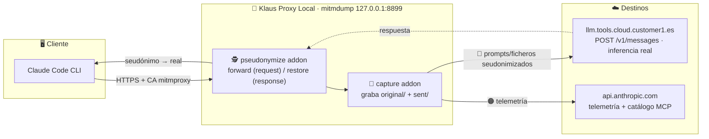

# 🏗️ Arquitectura — Klaus Proxy Local

## 🤔 ¿Qué hago? ¿Cómo lo hago? ¿Y para qué lo hago?

### ¿Qué hago?
**Klaus Proxy Local** es un **proxy local de auditoría** que se interpone entre Claude Code (u otro cliente de la API de Anthropic) y sus destinos reales — `api.anthropic.com` y el gateway LLM corporativo `llm.tools.cloud.customer1.es`. Intercepta cada petición HTTPS, **audita** el cuerpo exacto que sale del equipo, **seudonimiza en vuelo** los datos sensibles y **revierte** los seudónimos en la respuesta para que las tool calls sigan operando sobre valores reales.

### ¿Cómo lo hago?
No es un servidor propio: es un **`mitmproxy` local** (`mitmdump -p 8899`) con dos addons Python que se ejecutan en cadena sobre cada flujo, más tres CLIs de apoyo. El cliente se enruta por el proxy vía `HTTPS_PROXY` + `NODE_EXTRA_CA_CERTS` de forma **fail-closed** (si el proxy no escucha, `claude` aborta y no deja salir tráfico sin auditar).

### ¿Y para qué lo hago?
- **Privacidad / compliance**: documentar y controlar la frontera de datos real hacia la API — qué se envía, a qué host y qué contiene.
- **Prevención de fugas**: seudonimizar identidades, rutas y códigos internos antes de que salgan del equipo; redactar secretos de forma irreversible.
- **Trazabilidad**: evidencia auditable y verificable (`captures/`) de cada inferencia.

---

## 🗺️ Diagrama de arquitectura



> El **orden importa**: el seudonimizador corre **antes** que la captura, para que la evidencia de `sent/` refleje lo que *realmente* salió (ya seudonimizado).

---

## 🧩 Componentes (implementados)

Los cinco viven en [`src/`](../src) y se versionan; cada uno tiene su test espejo en [`tests/`](../tests). Los **datos** que producen (`captures/`) no se versionan.

| Componente | Módulo | Rol |
| --- | --- | --- |
| 🕵️ Seudonimizador | `anthropic_payload_pseudonymize.py` | Addon mitmproxy: reescribe datos sensibles del cuerpo por seudónimos estables (forward) y los revierte en la respuesta (restore). Vault bidireccional. |
| 💾 Captura | `anthropic_payload_capture.py` | Addon mitmproxy: graba el par espejo `original/` + `sent/` de cada request, redactando secretos de cabeceras. |
| ✅ Verificador | `anthropic_capture_verify.py` | CLI: comprueba destino, secretos redactados y cero fugas sobre la última captura. |
| 🔬 Analizador | `anthropic_payload_analyze.py` | CLI: vuelca todo lo que sale al modelo (system, tools, historial, ficheros embebidos). |
| 🧹 Limpieza/hardening | `anthropic_artifacts_cleanup.py` | CLI: mitiga el riesgo *data-at-rest* (artefactos en claro que Claude Code deja en disco). |

---

## 🗂️ Estructura del repositorio

```text
klaus-proxy-local/
├── src/
│   ├── anthropic_payload_pseudonymize.py   # addon: forward/restore
│   ├── anthropic_payload_capture.py        # addon: graba evidencia
│   ├── anthropic_capture_verify.py         # CLI: verifica una captura
│   ├── anthropic_pair_verify.py            # CLI: validador diferencial original↔sent
│   ├── anthropic_payload_analyze.py        # CLI: analiza el payload
│   ├── anthropic_artifacts_cleanup.py      # CLI: limpieza + hardening
│   └── Klaus_proxy_local/                  # 🔴 stub del gateway (roadmap, ver abajo)
├── tests/                                  # suite pytest espejo (158 tests)
├── docs/                                   # esta documentación + runbook + MANIFIESTO + MANUAL
├── captures/                               # 🔒 DATOS SENSIBLES (gitignored): original/, sent/, vault
├── pyproject.toml                          # paquete + config de ruff/black/pytest
├── requirements.txt / requirements-dev.txt # runtime (mitmproxy) / desarrollo (pytest)
└── .github/
    ├── workflows/ci.yml                    # lint + test matrix
    ├── workflows/codeql.yml                # SAST
    └── codeql/codeql-config.yml            # excluye tests/ del SAST
```

> ⚠️ **`captures/` nunca se versiona.** Contiene prompts, contenido real de ficheros y el vault `real↔seudónimo`. Está en `.gitignore` y jamás debe subir a este repositorio público.

---

## 🔐 El vault y la palanca de rutas

- **Vault** (`captures/.pseudonym_vault.json`): mapa bidireccional `real↔seudónimo` (hash con sal, estable, no reversible sin el vault). Es el fichero **más sensible** de la auditoría; gitignored.
- **Anclaje desacoplado**: las capturas y el vault se resuelven relativas al **tooling** (`Path(__file__).parents[1]/captures/`), mientras que la **raíz del proyecto auditado** (palanca de rutas + identidad git) sale del `cwd` del proceso `mitmdump` o de `ANTHROPIC_PSEUDO_PROJECT_ROOT`. Así el tooling audita cualquier repo sin acoplarse a él.

Detalle completo del mecanismo en [`anthropic-audit-proxy.md`](./anthropic-audit-proxy.md).

---

## 🛣️ Roadmap — gateway/proxy inteligente

Sobre esta base de interceptación se pueden añadir capacidades de gateway que la API oficial no ofrece. **No están implementadas todavía**; el paquete `src/Klaus_proxy_local/` es un stub (`main()` lanza `NotImplementedError`) que reserva el punto de entrada.

| Capacidad planificada | Estado |
| --- | --- |
| 💾 Caché semántica (respuestas sin reconsumir tokens) | 🔴 Por implementar |
| 📊 Observabilidad / métricas de uso y coste | 🔴 Por implementar |
| 🔑 Auth & rate limiting local | 🔴 Por implementar |
| 🔄 Cliente upstream multi-proveedor con streaming | 🔴 Por implementar |

Las dependencias `httpx`/`fastapi`/`uvicorn`/`anthropic` declaradas en `pyproject.toml` dan soporte a este roadmap; el runtime **actual** (los addons) usa `mitmproxy`.

---

## 🔗 Documentos relacionados

- [🔍 Runbook del proxy de auditoría](anthropic-audit-proxy.md) — captura, seudonimización, verificación, arranque
- [📁 MANIFIESTO](MANIFIESTO_ficheros_embebidos.md) — qué información sale en `/v1/messages`
- [🧹 MANUAL de limpieza/hardening](MANUAL_limpieza_hardening.md) — riesgo *data-at-rest*
- [📋 CI/CD Pipeline](ci-cd.md) · [🔒 Seguridad](security.md) · [⚙️ Setup & Arranque](setup.md)
