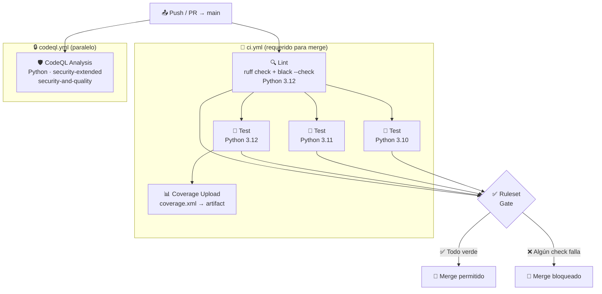

# ⚙️ CI/CD Pipeline — Klaus Proxy Local

## 🤔 ¿Qué hago? ¿Cómo lo hago? ¿Y para qué lo hago?

### ¿Qué hago?
Define y documenta el pipeline de integración y entrega continua del proyecto. Establece qué validaciones se ejecutan automáticamente antes de que cualquier cambio llegue a `main`.

### ¿Cómo lo hago?
Mediante **GitHub Actions** con dos workflows independientes:
- `ci.yml` — calidad de código: lint + test matrix multiplataforma
- `codeql.yml` — seguridad: análisis estático de vulnerabilidades

### ¿Y para qué lo hago?
Garantizar que `main` siempre contiene código que: compila, está formateado, pasa los tests y no tiene vulnerabilidades conocidas. El **Repository Ruleset** impide mergear PRs que no superen estos checks, haciendo el pipeline una barrera real y no opcional.

---

## 🗺️ Diagrama del pipeline



---

## 📋 Workflows

### `ci.yml` — Calidad de código

| Job | Trigger | Python | Herramientas |
| --- | --- | --- | --- |
| **Lint** | push/PR → main | 3.12 | ruff, black |
| **Test (3.10)** | tras Lint OK | 3.10 | pytest, pytest-cov |
| **Test (3.11)** | tras Lint OK | 3.11 | pytest, pytest-cov |
| **Test (3.12)** | tras Lint OK + upload coverage | 3.12 | pytest, pytest-cov |

**Instalación de dependencias:** `pip install -e ".[dev]"` — instala el paquete en modo editable junto con todas las dependencias de desarrollo declaradas en `pyproject.toml`.

**Concurrencia:** los runs del mismo workflow en la misma rama se cancelan (`cancel-in-progress: true`) para ahorrar minutos de GitHub Actions.

### `codeql.yml` — Seguridad SAST

| Parámetro | Valor |
| --- | --- |
| Lenguaje | Python |
| Queries | `security-extended` + `security-and-quality` |
| Config | [`.github/codeql/codeql-config.yml`](../.github/codeql/codeql-config.yml) — `paths-ignore: [tests]` |
| Schedule | Lunes 09:00 UTC (además de cada push/PR) |
| Permisos | `security-events: write` (publica en Security tab) |

Los findings aparecen en **Security → Code scanning alerts** del repositorio. Los
tests se excluyen del análisis: sus fixtures crean condiciones inseguras a
propósito para probar el hardening (ver [security.md](security.md)).

> 🔑 **GitGuardian** (GitHub App) escanea además cada PR en busca de secretos
> filtrados. Las fixtures de test que necesitan valores con forma de credencial se
> ensamblan en runtime a partir de fragmentos para no incrustar secretos literales.

---

## 🛡️ Repository Ruleset — checks requeridos

El Ruleset `#19607608 "Protect main"` exige que pasen los siguientes checks antes de permitir el merge:

```
Lint
Test (3.10)
Test (3.11)
Test (3.12)
```

Ninguna PR puede mergearse si alguno de estos jobs falla, independientemente de los permisos del autor.

---

## 🔧 Configuración de linters (`pyproject.toml`)

```toml
[tool.ruff]
target-version = "py310"
line-length = 88
src = ["src"]                    # addons sueltos en src/ → first-party para isort

[tool.ruff.lint]
select = ["E", "F", "I", "W"]   # errores, pyflakes, isort, warnings
ignore = ["E501"]                # longitud de línea delegada a black

[tool.black]
line-length = 88
target-version = ["py310", "py311", "py312"]
```

> Los linters están **fijados** en `[project.optional-dependencies].dev`
> (`ruff==0.16.0`, `black==25.11.0`): `black` cambia de estilo estable entre
> versiones, y un rango flotante haría que `black --check` en CI reformatee código
> ya formateado con otra versión. El pin garantiza formato reproducible local == CI.

---

## 🔗 Documentos relacionados

- [🏗️ Arquitectura](architecture.md) — estructura del proyecto y componentes
- [🔒 Seguridad](security.md) — Dependabot, CODEOWNERS, Rulesets
- [⚙️ Setup & Arranque](setup.md) — cómo ejecutar los tests en local
