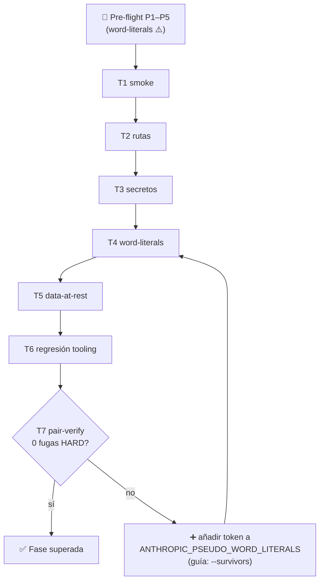

# 🧪 Plan de pruebas de control — Klaus Proxy Local

## 🤔 ¿Qué hago? ¿Cómo lo hago? ¿Y para qué lo hago?

- **¿Qué hago?** Defino un conjunto de pruebas de control para validar, de forma trazable, que el proxy de auditoría hace su trabajo end-to-end: audita, seudonimiza sin fugas, redacta secretos y revierte para que las tool calls funcionen.
- **¿Cómo lo hago?** Con un **pre-flight** (configuración correcta antes de capturar), una batería de **casos** con criterios de aceptación objetivos, y un **checklist** de cierre.
- **¿Para qué lo hago?** Para pasar a operación con garantías: cada release del tooling se valida contra este plan antes de auditar tráfico real.

> Contexto: este plan nace de la fase de control posterior a la extracción del tooling ([#6](https://github.com/Ka0s-Klaus/klaus-proxy-local/pull/6)). El barrido de capturas existentes detectó **fugas en claro de identificadores de org/repo/cliente** no cubiertos por el autodetect — de ahí el énfasis en el pre-flight de *word-literals* (caso **T4**).

---

## ✅ Pre-flight — configuración obligatoria antes de capturar

Un fallo aquí es la causa #1 de fugas. Verificar **todo** antes de generar capturas nuevas.

| # | Requisito | Cómo se cumple |
| --- | --- | --- |
| P1 | **CA de mitmproxy** presente | `~/.mitmproxy/mitmproxy-ca-cert.pem` existe (la crea el primer `mitmdump`). |
| P2 | **Proxy fail-closed** | La función `claude` de `~/.zshrc` aborta si `:8899` no escucha. |
| P3 | **Host del proveedor** correcto | `ANTHROPIC_CAPTURE_HOSTS` incluye el gateway real; el verificador se invoca con `--provider-host <host-real>` (los defaults del repo son ficticios: `llm.tools.cloud.customer1.es`). |
| P4 | **Word-literals completos** ⚠️ | `ANTHROPIC_PSEUDO_WORD_LITERALS` cubre **todo** identificador sensible que no autodetecta el tooling. |
| P5 | **Salt estable** | `ANTHROPIC_PSEUDO_SALT` fijo (seudónimos reproducibles entre corridas). |

### P4 en detalle — qué autodetecta el tooling y qué NO

El seudonimizador **autodetecta** a partir del repo con `cwd` (o `ANTHROPIC_PSEUDO_PROJECT_ROOT`):

- raíz del repo y `$HOME` (palanca de rutas),
- usuario del SO e identidad git (`user.name` / `user.email`),
- **org y nombre de repo del `remote origin` de ESE repo**,
- por regex: emails e IPv4.

**No** autodetecta (hay que añadirlos a `ANTHROPIC_PSEUDO_WORD_LITERALS`):

- nombres de **otras** organizaciones/repos referenciados en el prompt o en ficheros (p. ej. auditando el repo A pero el prompt menciona la org/repo del repo B),
- **códigos de cliente** cortos/ambiguos (2–3 letras),
- **dominios corporativos** e IDs de proyecto cloud.

```bash
# Ejemplo de arranque con word-literals exhaustivos (ajusta a tu contexto real):
ANTHROPIC_PSEUDO_WORD_LITERALS="Org1,repo-uno,Org2,repo-dos,CLIENTE_A,CLIENTE_B,ejemplo.com" \
  mitmdump -s src/anthropic_payload_pseudonymize.py \
           -s src/anthropic_payload_capture.py -p 8899
```

> 🔑 **Regla:** si un identificador debe ocultarse y **no** es el org/repo del repo con `cwd`, va en `ANTHROPIC_PSEUDO_WORD_LITERALS`. En la duda, añádelo (los word-literals casan con frontera de palabra: no corrompen substrings como `HTTPS`).

---

## 🧾 Casos de prueba

Cada caso: **acción** → **criterio de aceptación** (objetivo, verificable).

| ID | Caso | Acción | Criterio de aceptación |
| --- | --- | --- | --- |
| **T1** | Smoke end-to-end | `claude-proxy` en T1; `claude -p "responde: pong"` en T2 | Se genera un par `original/`+`sent/`; `anthropic_capture_verify.py --provider-host <real>` → **destino OK, secretos redactados, sin fugas**. |
| **T2** | Palanca de rutas | Prompt que fuerce un `Read` de un fichero del repo | En `sent/` la ruta sale como `/proj_xxxx/...` (estructura y extensión conservadas); el CLI ejecuta el `Read` real (reversión OK). **0 fugas** de home/usuario/ruta. |
| **T3** | Secretos Tier-1 | `Read`/`Bash` que arrastre un secreto (PEM, `AKIA…`, token) | En `original/` **y** `sent/` el secreto aparece como `«REDACTED:label»`; **no** entra al vault (irreversible). |
| **T4** | Cobertura word-literals (regresión del hallazgo) | Prompt que mencione org/repo/cliente de **otro** proyecto | Esos tokens salen seudonimizados (`org_…`); barrido de fugas → **0 fugas ALTA**. Si aparece alguno, falta en `ANTHROPIC_PSEUDO_WORD_LITERALS` (P4). |
| **T5** | Data-at-rest | `anthropic_artifacts_cleanup.py --harden --clean --older-than-days 14` (dry-run) → `--apply` | Dry-run lista el plan; tras `--apply` los ficheros quedan `0600` y los dirs `0700`; symlinks intactos; fuera de ámbito → SKIP. |
| **T6** | Regresión del tooling | `ruff check .` · `black --check .` · `pytest` | ruff/black limpios; **158 tests** en verde (local y CI 3.10/3.11/3.12). |
| **T7** | Barrido diferencial por pares | `python3 src/anthropic_pair_verify.py` sobre `captures/original/` ↔ `captures/sent/` | Veredicto por par; **0 pares con fugas HARD** en las capturas nuevas (exit code `0`). El `--survivors` no lista ningún slug sensible sin cubrir (tras P4). |

---

## 📊 Criterios de aceptación de la fase

La fase de control se considera **superada** cuando:

1. **T1–T7 en verde** con la configuración de pre-flight documentada.
2. **Cero fugas de ALTA sensibilidad** en el barrido de capturas nuevas (T7).
3. **CI verde** en `main` (Lint, Test 3.10/3.11/3.12, CodeQL, GitGuardian).
4. El pre-flight (P1–P5) queda **registrado** con los valores reales usados (en local, nunca en el repo).

---

## 🗺️ Flujo de ejecución



---

## 📝 Registro de resultados

- Los **veredictos** (PASS/FAIL por caso) se anotan aquí o en el issue de la corrida.
- Las **capturas** que respaldan cada caso viven en `captures/` (gitignored) — **nunca** se versionan; se referencian por nombre/fecha.
- Los **valores reales** de pre-flight (host, word-literals, salt) se registran en local, **no** en el repo.

---

## 🔗 Documentos relacionados

- [🔍 Runbook del proxy de auditoría](anthropic-audit-proxy.md) — arranque, seudonimización, verificación
- [🏗️ Arquitectura](architecture.md) · [🔒 Seguridad](security.md) · [⚙️ Setup](setup.md)
- [📁 MANIFIESTO](MANIFIESTO_ficheros_embebidos.md) · [🧹 MANUAL de limpieza/hardening](MANUAL_limpieza_hardening.md)
