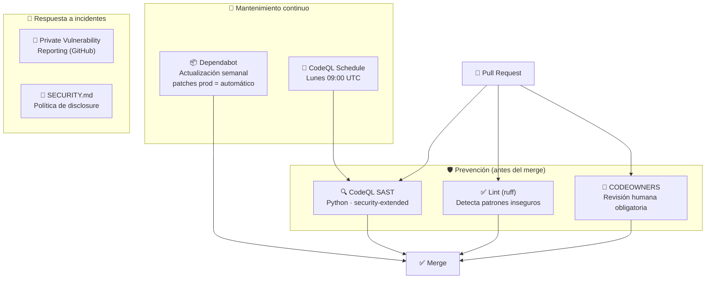

# 🔒 Seguridad — Klaus Proxy Local

## 🤔 ¿Qué hago? ¿Cómo lo hago? ¿Y para qué lo hago?

### ¿Qué hago?
Documenta la postura de seguridad del repositorio: qué mecanismos automáticos protegen el código, las dependencias y el proceso de contribución.

### ¿Cómo lo hago?
Mediante cuatro capas de defensa configuradas en GitHub:
1. **CodeQL** — análisis estático de vulnerabilidades en el código fuente
2. **Dependabot** — actualización automática de dependencias vulnerables
3. **CODEOWNERS + Ruleset** — control de acceso y revisión obligatoria
4. **SECURITY.md** — proceso de reporte responsable de vulnerabilidades

### ¿Y para qué lo hago?
Un proxy que intermedia tráfico de API keys de Anthropic es un objetivo de alto valor. La seguridad no es opcional: una vulnerabilidad en las dependencias o en el código puede exponer las keys de todos los usuarios del proxy.

---

## 🗺️ Capas de seguridad



---

## 🔍 CodeQL SAST

| Parámetro | Valor |
| --- | --- |
| Queries | `security-extended` + `security-and-quality` |
| Trigger | push → main, PR → main, schedule semanal |
| Schedule | Lunes 09:00 UTC |
| Resultados | Security → Code scanning alerts |

Las queries `security-extended` cubren CWEs adicionales más allá del conjunto básico, incluyendo injection, path traversal y deserialización insegura — relevantes para un proxy HTTP.

---

## 📦 Dependabot — política de actualizaciones

### Ecosistema pip

| Tipo de update | Política |
| --- | --- |
| **Major** | PR manual — requiere revisión |
| **Minor** | PR manual — requiere revisión |
| **Patch (producción)** | ✅ PR automática — fluye sin restricción |
| **Patch (dev tools)** | ⏭️ Ignorado — ruff, black, pytest, pytest-cov |

Los patches de dependencias de producción (`httpx`, `fastapi`, `uvicorn`, `anthropic`) se actualizan automáticamente porque frecuentemente contienen fixes de seguridad críticos (OWASP A06 — Vulnerable and Outdated Components).

### Ecosistema github-actions

| Parámetro | Valor |
| --- | --- |
| Schedule | Semanal, lunes 08:00 Madrid |
| Max PRs abiertas | 3 |
| Labels | `dependencies`, `github-actions` |

---

## 👤 CODEOWNERS y Ruleset

```
# CODEOWNERS
* @asantacana1970
* @Ka0s-Klaus/maintainers
.github/workflows/ @asantacana1970
SECURITY.md @asantacana1970
```

El **Repository Ruleset `#19607608 "Protect main"`** impone:

| Regla | Valor |
| --- | --- |
| PR obligatoria | ✅ Sí |
| Reviewers requeridos | 1 (+ CODEOWNER aprobación) |
| Required status checks | Lint, Test (3.10), Test (3.11), Test (3.12) |
| Force push | ❌ Prohibido |
| Delete branch main | ❌ Prohibido |

---

## 🔐 Reporte de vulnerabilidades

Las vulnerabilidades de seguridad **no** se reportan como issues públicas. Usar el canal de **Private Vulnerability Reporting** de GitHub:

`Security → Report a vulnerability` en el repositorio

Ver [SECURITY.md](../SECURITY.md) para el proceso completo y tiempos de respuesta.

---

## ⚠️ Consideraciones de seguridad para el proxy

Por su naturaleza, Klaus Proxy Local maneja información sensible:

- **API keys de Anthropic** — nunca persistir en logs ni caché
- **Contenido de prompts** — pueden contener datos confidenciales del usuario
- **Solo loopback** — el servidor debe escuchar en `127.0.0.1`, nunca en `0.0.0.0`
- **Secrets en `.env`** — nunca hardcodear, siempre variables de entorno; `.env` en `.gitignore`

---

## 🔗 Documentos relacionados

- [⚙️ CI/CD Pipeline](ci-cd.md) — checks automáticos que refuerzan la seguridad
- [🏗️ Arquitectura](architecture.md) — diseño del sistema y superficie de ataque
- [📄 SECURITY.md](../SECURITY.md) — política de disclosure responsable
