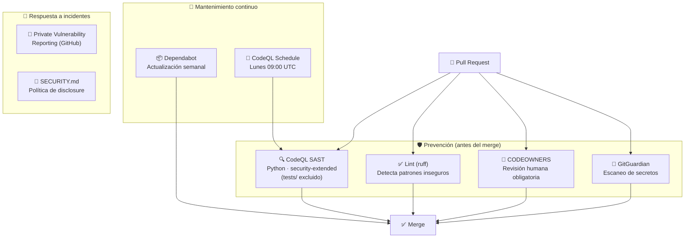

# 🔒 Seguridad — Klaus Proxy Local

## 🤔 ¿Qué hago? ¿Cómo lo hago? ¿Y para qué lo hago?

### ¿Qué hago?

Documenta la postura de seguridad del repositorio: qué mecanismos automáticos protegen el código, las dependencias y el proceso de contribución — y qué datos sensibles maneja el proxy de auditoría.

### ¿Cómo lo hago?

Mediante cuatro capas de defensa configuradas en GitHub:

1. **CodeQL** — análisis estático de vulnerabilidades en el código fuente
2. **Dependabot** — actualización automática de dependencias vulnerables
3. **CODEOWNERS + Ruleset** — control de acceso y revisión obligatoria
4. **SECURITY.md** — proceso de reporte responsable de vulnerabilidades

### ¿Y para qué lo hago?

El proxy intercepta el tráfico de Claude Code: ve **prompts, contenido de ficheros del repo y un vault con el mapa `real↔seudónimo`**. Ese material es de alto valor. La seguridad no es opcional: una fuga de `captures/` o del vault expondría datos reales que la seudonimización existe precisamente para proteger.

---

## 🗺️ Capas de seguridad



---

## 🔍 CodeQL SAST

| Parámetro | Valor |
| --- | --- |
| Queries | `security-extended` + `security-and-quality` |
| Trigger | push → main, PR → main, schedule semanal |
| Schedule | Lunes 09:00 UTC |
| Config | [`.github/codeql/codeql-config.yml`](../.github/codeql/codeql-config.yml) |
| Resultados | Security → Code scanning alerts |

Las queries `security-extended` cubren CWEs adicionales — injection, path traversal, deserialización insegura — relevantes para un proxy que reescribe tráfico HTTP.

> ℹ️ **`tests/` se excluye del análisis** (`paths-ignore`). Sus fixtures reproducen a propósito condiciones inseguras (p. ej. ficheros world-readable con `os.chmod(..., 0o644)`) para verificar que la herramienta de hardening las corrige; escanearlas genera falsos positivos sobre datos de prueba, no sobre el producto.

---

## 📦 Dependabot — política de actualizaciones

### Ecosistema pip

| Tipo de update | Política |
| --- | --- |
| **Major** | PR manual — requiere revisión |
| **Minor** | PR manual — requiere revisión |
| **Patch (producción)** | ✅ PR automática — fluye sin restricción |
| **Patch (dev tools)** | ⏭️ Ignorado — `ruff`, `black` están **fijados** por reproducibilidad |

El runtime del proxy es `mitmproxy` (en `requirements.txt`). Las dependencias `httpx`/`fastapi`/`uvicorn`/`anthropic` de `pyproject.toml` dan soporte al [gateway del roadmap](architecture.md); sus patches de seguridad interesan igualmente (OWASP A06 — *Vulnerable and Outdated Components*).

### Ecosistema github-actions

| Parámetro | Valor |
| --- | --- |
| Schedule | Semanal, lunes 08:00 Madrid |
| Max PRs abiertas | 3 |
| Labels | `dependencies`, `github-actions` |

---

## 👤 CODEOWNERS y Ruleset

```text
# CODEOWNERS
* @asantacana1970 @Ka0s-Klaus/ka0s-owners
.github/workflows/ @asantacana1970 @Ka0s-Klaus/ka0s-owners
SECURITY.md @asantacana1970
```

El **Repository Ruleset "Protect main"** impone:

| Regla | Valor |
| --- | --- |
| PR obligatoria | ✅ Sí |
| Reviewers requeridos | 0 — los CI checks son la barrera de calidad |
| Bypass actors | Rol `admin` del repositorio (permite al owner mergear en flujo en solitario) |
| Required status checks | Lint, Test (3.10), Test (3.11), Test (3.12) |
| Force push | ❌ Prohibido |
| Delete branch main | ❌ Prohibido |

---

## 🔐 Reporte de vulnerabilidades

Las vulnerabilidades de seguridad **no** se reportan como issues públicas. Usar el canal de **Private Vulnerability Reporting** de GitHub:

`Security → Report a vulnerability` en el repositorio

Ver [SECURITY.md](../SECURITY.md) para el proceso completo y tiempos de respuesta.

---

## ⚠️ Consideraciones de seguridad del proxy de auditoría

Por su naturaleza, Klaus Proxy Local maneja información sensible real:

- **`captures/` y el vault nunca se versionan** — contienen prompts, contenido de ficheros en claro y el mapa `real↔seudónimo`. Están hard-gitignored y jamás deben subir al repositorio público.
- **Secretos redactados de forma irreversible** — claves privadas PEM, tokens AWS/GitHub/Google/Slack, JWT: se sustituyen por `«REDACTED:label»` y **no** entran al vault (no se revierten).
- **Credenciales fuera de disco** — el proxy no persiste `ANTHROPIC_AUTH_TOKEN` ni ninguna API key; las hereda del entorno el proceso `claude` enrutado.
- **Solo loopback** — el proxy escucha en `127.0.0.1:8899`, nunca en `0.0.0.0`.
- **Riesgo *data-at-rest*** — Claude Code deja artefactos en claro (`~/.claude`, `/private/tmp`). Se mitiga con [`anthropic_artifacts_cleanup.py`](../src/anthropic_artifacts_cleanup.py) (ver [MANUAL](MANUAL_limpieza_hardening.md)); el cifrado de disco (FileVault) es el control de fondo.

---

## 🔗 Documentos relacionados

- [⚙️ CI/CD Pipeline](ci-cd.md) — checks automáticos que refuerzan la seguridad
- [🏗️ Arquitectura](architecture.md) — diseño del sistema y superficie de ataque
- [🧹 MANUAL de limpieza/hardening](MANUAL_limpieza_hardening.md) — riesgo *data-at-rest*
- [📄 SECURITY.md](../SECURITY.md) — política de disclosure responsable
