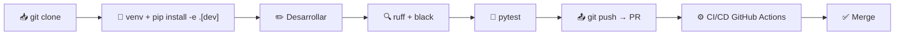

# ⚙️ Setup & Arranque — Klaus Proxy Local

## 🤔 ¿Qué hago? ¿Cómo lo hago? ¿Y para qué lo hago?

### ¿Qué hago?
Guía completa para instalar, configurar y ejecutar Klaus Proxy Local en un entorno de desarrollo local.

### ¿Cómo lo hago?
El paquete usa **setuptools** con `src/` layout y `pyproject.toml`. La instalación en modo editable (`pip install -e ".[dev]"`) permite desarrollar y testear sin reinstalar tras cada cambio.

### ¿Y para qué lo hago?
Cualquier colaborador debe poder clonar el repo y tener un entorno funcional en menos de 5 minutos, sin pasos manuales ni dependencias implícitas.

---

## 🚀 Quickstart

```bash
# 1. Clonar
git clone https://github.com/Ka0s-Klaus/Klaus-proxy-local.git
cd Klaus-proxy-local

# 2. Crear entorno virtual (recomendado)
python -m venv .venv
source .venv/bin/activate          # Linux/macOS
# .venv\Scripts\activate           # Windows

# 3. Instalar en modo editable con deps de desarrollo
pip install -e ".[dev]"

# 4. Configurar credenciales
cp .env.example .env               # editar con tu API key de Anthropic
```

---

## 📋 Requisitos

| Requisito | Versión mínima |
| --- | --- |
| Python | 3.10 |
| pip | 23.0 |
| Git | cualquiera |

---

## 🔑 Variables de entorno

Copiar `.env.example` a `.env` y completar los valores:

| Variable | Descripción | Obligatoria |
| --- | --- | --- |
| `ANTHROPIC_API_KEY` | API key de Anthropic | ✅ Sí |
| `PROXY_HOST` | Host de escucha (solo `127.0.0.1`) | No (default: `127.0.0.1`) |
| `PROXY_PORT` | Puerto del proxy | No (default: `8080`) |
| `LOG_LEVEL` | Nivel de logging (`INFO`, `DEBUG`) | No (default: `INFO`) |

> ⚠️ **Nunca** commitear `.env`. El fichero está en `.gitignore` y en `CODEOWNERS` bajo supervisión de seguridad.

---

## 🧪 Ejecutar tests

```bash
# Todos los tests con coverage
pytest --cov=src --cov-report=term-missing

# Test rápido sin coverage
pytest -q

# Un test específico
pytest tests/test_placeholder.py -v
```

---

## 🔍 Linting

```bash
# Verificar estilo (ruff)
ruff check .

# Verificar formato (black)
black --check .

# Aplicar formato automáticamente
black .
ruff check . --fix
```

---

## 🗺️ Flujo de desarrollo



---

## 🔗 Documentos relacionados

- [🏗️ Arquitectura](architecture.md) — qué hace el proxy y cómo está estructurado
- [⚙️ CI/CD Pipeline](ci-cd.md) — qué validaciones se ejecutan en cada PR
- [🔒 Seguridad](security.md) — consideraciones de seguridad para desarrollo
- [📄 CONTRIBUTING.md](../CONTRIBUTING.md) — guía de contribución al proyecto
