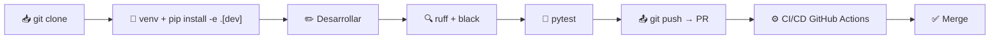

# ⚙️ Setup & Arranque — Klaus Proxy Local

## 🤔 ¿Qué hago? ¿Cómo lo hago? ¿Y para qué lo hago?

### ¿Qué hago?
Guía para instalar el proxy de auditoría, arrancarlo, enrutar Claude Code por él y ejecutar la suite de tests en local.

### ¿Cómo lo hago?
El **runtime** es `mitmproxy` (el proxy) con los dos addons de [`src/`](../src). Para **desarrollo y tests** el paquete usa `setuptools` con layout `src/` y `pyproject.toml`; la instalación editable (`pip install -e ".[dev]"`) trae `pytest`, `ruff` y `black`.

### ¿Y para qué lo hago?
Que cualquier colaborador pueda clonar el repo, tener un entorno funcional y auditar una sesión de Claude Code en pocos minutos, sin pasos manuales ni credenciales en disco.

---

## 📋 Requisitos

| Requisito | Versión mínima | Para qué |
| --- | --- | --- |
| Python | 3.10 | ejecutar addons y tests |
| mitmproxy | 10 (`< 12`) | el proxy (`mitmdump`) |
| pip | 23.0 | instalación editable |
| Git | cualquiera | detección de identidad/remote del repo auditado |

---

## 🚀 Quickstart

```bash
# 1. Clonar
git clone https://github.com/Ka0s-Klaus/klaus-proxy-local.git
cd klaus-proxy-local

# 2. Entorno virtual (recomendado)
python -m venv .venv
source .venv/bin/activate           # Linux/macOS
# .venv\Scripts\activate            # Windows

# 3. Runtime del proxy: mitmproxy (vía Homebrew o pip)
brew install mitmproxy              # o: pip install -r requirements.txt

# 4. Dependencias de desarrollo (tests + linters)
pip install -e ".[dev]"

# 5. Generar la CA de mitmproxy (primer arranque de mitmdump la crea en ~/.mitmproxy)
mitmdump --version
```

> No hay `.env` ni `ANTHROPIC_API_KEY` que gestionar: el proxy **no** almacena credenciales. Las credenciales del proveedor (`ANTHROPIC_BASE_URL`, `ANTHROPIC_AUTH_TOKEN`) las hereda del entorno el proceso `claude` que enrutes; el proxy solo antepone `HTTPS_PROXY`/`NODE_EXTRA_CA_CERTS`.

---

## ▶️ Arrancar el proxy y auditar una sesión

```bash
# Terminal 1 — proxy de auditoría en primer plano (logs en vivo):
mitmdump -s src/anthropic_payload_pseudonymize.py \
         -s src/anthropic_payload_capture.py -p 8899

# Terminal 2 — un claude NUEVO enrutado por el proxy (Node no usa el keychain
# del sistema, de ahí NODE_EXTRA_CA_CERTS):
HTTPS_PROXY=http://127.0.0.1:8899 HTTP_PROXY=http://127.0.0.1:8899 \
NODE_EXTRA_CA_CERTS=~/.mitmproxy/mitmproxy-ca-cert.pem \
claude -p "responde solo con la palabra: pong"

# Terminal 2 — verifica en un comando lo que salió del equipo:
python3 src/anthropic_capture_verify.py
```

> El runbook completo (funciones `claude-proxy`/`claude` fail-closed de `~/.zshrc`, LaunchAgent opcional, seudonimización bidireccional) está en [`anthropic-audit-proxy.md`](./anthropic-audit-proxy.md).

---

## 🔑 Variables de entorno

El proxy se configura por entorno (no por `.env`). Las más habituales:

| Variable | Efecto | Por defecto |
| --- | --- | --- |
| `ANTHROPIC_CAPTURE_HOSTS` | Hosts a auditar (coma-separada) | `api.anthropic.com,llm.tools.cloud.customer1.es` |
| `ANTHROPIC_CAPTURE_DIR` | Directorio base de capturas | `captures/` |
| `ANTHROPIC_PSEUDO_ENABLE` | Interruptor de la seudonimización | `1` |
| `ANTHROPIC_PSEUDO_WORD_LITERALS` | Literales con frontera de palabra (org/proj IDs) | — |
| `ANTHROPIC_PSEUDO_PROJECT_ROOT` | Raíz del proyecto **auditado** (palanca de rutas + git) | `cwd` del proceso |
| `ANTHROPIC_PSEUDO_VAULT` | Ruta del vault de seudonimización | `captures/.pseudonym_vault.json` |

> Tabla completa de flags en [`anthropic-audit-proxy.md`](./anthropic-audit-proxy.md).

---

## 🧪 Ejecutar tests

```bash
pytest                                        # suite completa (123 tests)
pytest --cov=src --cov-report=term-missing    # con coverage
pytest tests/test_anthropic_capture_verify.py # un fichero concreto
```

La configuración de pytest vive en `pyproject.toml` (`[tool.pytest.ini_options]`); `tests/conftest.py` añade `src/` al `sys.path` para importar los addons sin instalarlos.

---

## 🔍 Linting y formato

```bash
ruff check .        # linter
black --check .     # formato (verifica)
black .             # formato (aplica)
ruff check . --fix  # autofix de lint
```

> `ruff` y `black` están **fijados** en `pyproject.toml` (`ruff==0.16.0`, `black==25.11.0`) para que el formato sea reproducible entre local y CI.

---

## 🗺️ Flujo de desarrollo



---

## 🔗 Documentos relacionados

- [🏗️ Arquitectura](architecture.md) — qué hace el proxy y cómo está estructurado
- [🔍 Runbook de auditoría](anthropic-audit-proxy.md) — captura, seudonimización, verificación
- [⚙️ CI/CD Pipeline](ci-cd.md) — validaciones en cada PR
- [🔒 Seguridad](security.md) — postura de seguridad del repo
- [📄 CONTRIBUTING.md](../CONTRIBUTING.md) — guía de contribución
